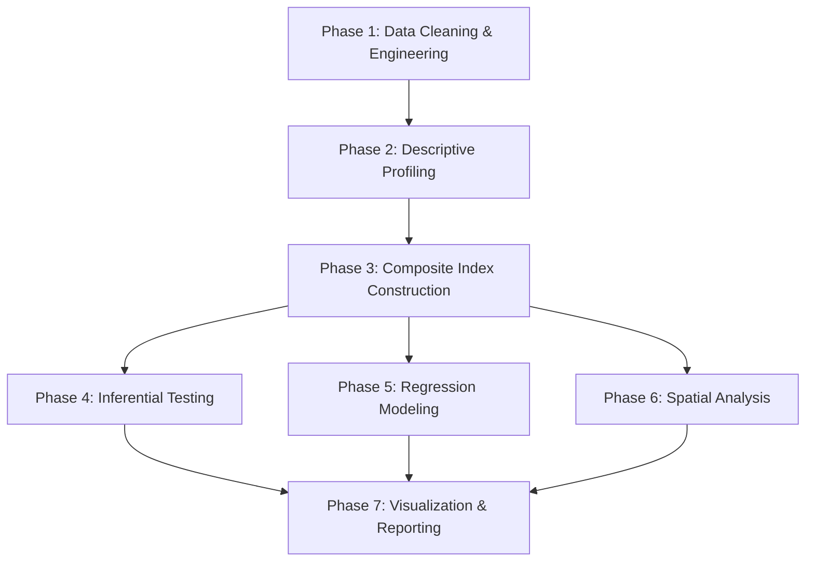

# Effects of Access to Potable Water on Livelihood Assets — Shama Municipality

## 1. Research Context & Data Summary

**Objective**: Examine the effects of access to potable drinking water on livelihood assets in the Shama Municipality.

**Theoretical Framework**: The **DFID Sustainable Livelihoods Framework (SLF)** — which decomposes livelihood assets into **five capitals** — provides the analytical lens for this study.

### Dataset at a Glance

| Property | Value |
|---|---|
| **Respondents** | 69 households |
| **Communities** | Beposo Dunkwa (34), Atwereboanda (20), Shama (15) |
| **Variables** | 148 columns |
| **GPS-located water sources** | 10 points (Well, Borehole, Pipe-borne, River/Stream) |
| **Response types** | Likert (SD/D/N/A/SA), Categorical, Numeric, Open-ended |

### Key Distributions (snapshot)

| Variable | Dominant Category |
|---|---|
| **Primary water source** | Borehole (49%), Pipe-borne (32%) |
| **Distance to source** | <100m (78%) |
| **Trip time** | <30 min (75%) |
| **Earnings** | <GH₵499/month (41%), GH₵500–999 (30%) |
| **Primary livelihood** | Food crops (32%), Trading (23%), Skilled trade (19%) |
| **Economic effect of water** | Negative (51%), No effect (42%) |
| **Who fetches water** | Children (38%), All members (32%), Women (22%) |
| **Weekly water cost** | GH¢6–10 (35%), No cost (30%) |

---

## 2. Mapping Survey Variables to the SLF Five Capitals

This is the **foundation** of the entire analysis. Every survey question must be mapped to a livelihood capital before any modeling begins.

### 2.1 Human Capital
> *Education, health, skills, labor capacity, knowledge*

| Survey Question | Variable Type | Rationale |
|---|---|---|
| Q3. Age | Categorical (4 bands) | Labor capacity proxy |
| Q7i. Educational level | Categorical (5 levels) | Knowledge & skill endowment |
| Q9i. Occupation | Categorical (7 types) | Skill specialization |
| Q28. Water safe for drinking without treatment | Likert | Health risk perception |
| Q33i. Do you treat water before use? | Binary (Yes/No) | Health behavior / awareness |
| Q39. Waterborne diseases → healthcare expenses | Likert | Health impact of water quality |
| Q40. Potable water reduced workload for women/children | Likert | Gendered labor burden |
| Q41. School attendance not affected by water fetching | Likert | Education disruption |
| Q31. Who is primarily responsible for fetching water? | Categorical | Gendered labor allocation |

### 2.2 Financial Capital
> *Income, savings, expenditure, cost burden*

| Survey Question | Variable Type | Rationale |
|---|---|---|
| Q10. Average monthly earnings | Categorical (5 bands) | Income level |
| Q25. Cost of water is affordable | Likert | Financial burden perception |
| Q26. Water spending does not limit other needs | Likert | Crowding-out effect |
| Q32. Weekly cost of water access | Categorical (5 bands) | Direct financial expenditure |
| Q37. Income loss due to time fetching water | Likert | Opportunity cost |
| Q38. Water cost increased operational costs | Likert | Business cost impact |
| Q43. Water shortage → increased food prices | Likert | Indirect economic cascading |
| Q44. How water affects economic activities | Categorical (4 types) | Overall economic perception |

### 2.3 Physical Capital
> *Infrastructure, storage, transport, built environment*

| Survey Question | Variable Type | Rationale |
|---|---|---|
| Q13i. Primary water source | Categorical | Infrastructure type relied on |
| Q17. Distance to main source | Categorical (2 bands) | Spatial infrastructure access |
| Q18. Minutes for a water trip | Categorical (3 bands) | Infrastructure convenience |
| Q30i. How do you transport water? | Categorical | Technology/infrastructure for transport |
| Q34i. Container type for collection | Categorical | Physical asset ownership |
| Q54. Invested in more storage tanks | Likert | Capital investment in physical assets |
| Q56i. Type of storage facility | Multi-select binary | Physical asset inventory |
| Q61. Satisfied with maintenance of facilities | Likert | Infrastructure quality |
| Q62. Maintenance conducted regularly | Likert | Infrastructure upkeep |

### 2.4 Natural Capital
> *Water quantity, quality, reliability, seasonality*

| Survey Question | Variable Type | Rationale |
|---|---|---|
| Q11i. Available water sources | Multi-select binary | Natural resource diversity |
| Q12. How many sources used | Numeric | Resource portfolio breadth |
| Q19. Main source available every day | Likert | Temporal availability |
| Q20. Water flow reliable and consistent | Likert | Supply reliability |
| Q21. Source does not run dry in dry season | Likert | Seasonal resilience |
| Q27. Satisfied with water clarity | Likert | Perceived water quality |
| Q35. Household daily water use | Categorical | Consumption demand on natural stock |
| Q55. Rainwater harvesting used | Likert | Dependence on natural precipitation |

### 2.5 Social Capital
> *Community networks, governance, institutional support, trust*

| Survey Question | Variable Type | Rationale |
|---|---|---|
| Q4i. Religious affiliation | Categorical | Social network identity |
| Q5i. Ethnic group | Categorical | Community cohesion |
| Q6. Marital status | Categorical | Household social structure |
| Q51. Restrict outsiders from stored water | Likert | Social exclusion / reciprocity |
| Q58. Effective community-based initiatives | Likert | Collective action capacity |
| Q59. Adequate support from authorities/NGOs | Likert | Institutional social capital |
| Q60. Water agency responsive to complaints | Likert | Institutional trust |
| Q63. Water agency addresses challenges | Likert | Governance effectiveness |
| Q64i. Main body responsible for maintenance | Categorical | Institutional identification |

---

## 3. Analytical Pathways

The analysis proceeds in **7 phases**, each building on the previous. Below is the full roadmap.

---

### Phase 1: Data Cleaning & Variable Engineering

> [!IMPORTANT]
> This phase produces the **cleaned, analysis-ready dataset** that all subsequent phases depend on. No analysis should begin before this is complete.

#### 1.1 Header Standardization
- Rename all 148 columns to short, code-friendly names (e.g., `Q3_age`, `Q10_earnings`, `Q19_source_available_daily`).
- Drop duplicate/empty columns (columns 128–138 appear to be duplicates with all NaN values).
- Drop metadata columns (`_id`, `_uuid`, `_submission_time`, `_validation_status`, `_notes`, `_status`, `_submitted_by`, `__version__`, `_tags`, `_index`).

#### 1.2 Likert Encoding
- Encode all Likert responses numerically: `SD=1, D=2, N=3, A=4, SA=5`.
- This converts 25+ Likert columns into ordinal integers suitable for correlation, PCA, and regression.

#### 1.3 Categorical Encoding
- **Ordinal variables** (Age, Education, Distance, Time, Earnings, Weekly cost): encode with meaningful numeric order.
  - Age: `18-24=1, 25-34=2, 35-54=3, 55-64=4`
  - Education: `Primary=1, JHS=2, SHS=3, Vocational=4, Other=5`
  - Earnings: `No salary=0, <499=1, 500-999=2, 1000-1999=3, 2000+=4`
  - Distance: `<100m=1, 100-500m=2`
  - Trip time: `<30min=1, 30min=2, >30min=3`
  - Weekly cost: `No cost=0, <5=1, 6-10=2, 11-15=3, 16+=4`
- **Nominal variables** (Community, Occupation, Primary source, Transport method): one-hot encode for regression, leave as labels for descriptive.

#### 1.4 Binary Flags
- Multi-select questions (Q11i, Q14i, Q15i, Q45i, Q56i) already exist as binary (0/1) columns. Verify and clean.

#### 1.5 Derived Variables
| New Variable | Formula | Purpose |
|---|---|---|
| `water_access_score` | Mean of Likert Q19–Q28 (10 items) | Composite access quality measure |
| `livelihood_impact_score` | Mean of Likert Q37–Q43 (7 items) | Composite livelihood disruption |
| `coping_intensity_score` | Mean of Likert Q47–Q55 (9 items) | Composite coping strategy intensity |
| `governance_score` | Mean of Likert Q59–Q63 (5 items) | Composite institutional support |
| `source_diversity` | Count of 1s in Q11i binary columns | Number of available water sources |
| `water_cost_ratio` | Weekly cost midpoint / Monthly earnings midpoint | Proportion of income spent on water |

**Output**: A single cleaned DataFrame saved as `ANALYSIS_READY_WATER_SHAMA.xlsx`.

---

### Phase 2: Descriptive Profiling

#### 2.1 Sociodemographic Profile
- Frequency tables and bar charts for: Community, Age, Education, Marital status, Occupation, Household size, Earnings.
- Cross-tabulation: Community × Occupation, Community × Earnings.

#### 2.2 Water Access Profile
- Frequency distributions: Primary source, Distance, Trip time, Collection frequency, Transport method, Who fetches.
- Stacked bar chart: Water source availability by community.
- Mean Likert scores for Q19–Q28 (reliability, quality, affordability) by community.

#### 2.3 Livelihood Impact Profile
- Frequency distributions: Primary livelihood, Economic effect perception.
- Mean Likert scores for Q37–Q43 by community.
- Diverging bar chart (Likert plot) for all impact statements.

#### 2.4 Coping Strategy Profile
- Mean scores for Q47–Q55 by community.
- Most vs. least adopted strategies ranking.

**Output**: A comprehensive descriptive statistics notebook section with 15–20 publication-ready charts.

---

### Phase 3: Composite Index Construction

> [!IMPORTANT]
> This is the **core analytical innovation** — constructing composite indices for the five livelihood capitals and a Water Access Index (WAI), enabling quantitative comparison.

#### 3.1 Water Access Index (WAI)
Constructed from three sub-dimensions:

| Sub-dimension | Variables | Weight |
|---|---|---|
| **Availability** | Q19 (daily), Q20 (reliable flow), Q21 (dry season), Q16 (alt. freq.) | 0.40 |
| **Accessibility** | Q17 (distance), Q18 (trip time), Q22 (convenient), Q23 (no disruption), Q24 (any time) | 0.35 |
| **Quality & Affordability** | Q25 (affordable), Q27 (clarity), Q28 (safe without treatment) | 0.25 |

**Method**: 
1. Normalize each variable to 0–1 scale.
2. Calculate weighted sub-dimension means.
3. Final WAI = weighted sum of sub-dimensions → yields a 0–1 score per respondent.
4. Classify: **Low** (<0.40), **Moderate** (0.40–0.70), **High** (>0.70).

#### 3.2 Livelihood Capital Indices

For each of the five capitals, aggregate the mapped variables:

| Capital | Key Likert Items | Method |
|---|---|---|
| **Human Capital Index (HCI)** | Q7i (education), Q39, Q40, Q41 + binary Q33i | Weighted mean after normalization |
| **Financial Capital Index (FCI)** | Q10 (earnings), Q25, Q26, Q32, Q37, Q38, Q43 | Weighted mean |
| **Physical Capital Index (PCI)** | Q17, Q18, Q30i, Q54, Q56i (count), Q61, Q62 | Weighted mean |
| **Natural Capital Index (NCI)** | Q12, Q19, Q20, Q21, Q27, Q35, Q55 | Weighted mean |
| **Social Capital Index (SCI)** | Q51, Q58, Q59, Q60, Q63 | Weighted mean |

**Composite Livelihood Asset Index (LAI)** = Equal-weighted mean of HCI, FCI, PCI, NCI, SCI.

#### 3.3 Internal Consistency
- Calculate **Cronbach's Alpha** for each index to verify reliability (target α ≥ 0.60 for exploratory research with small n).
- If α is low, remove poorly contributing items and recalculate.

**Output**: 6 new index columns appended to the analysis-ready dataset + reliability report.

---

### Phase 4: Inferential Statistical Testing

> [!NOTE]
> Given the sample size (n=69), ordinal data nature, and non-normal distributions expected, **non-parametric tests** are the primary approach.

#### 4.1 Association Tests (Categorical × Categorical)

| Test | Variables | Hypothesis |
|---|---|---|
| **Chi-Square / Fisher's Exact** | Primary source × Economic effect (Q44) | Water source type is associated with perceived economic impact |
| **Chi-Square** | Community × Primary source | Water infrastructure varies by community |
| **Chi-Square** | Distance × Livelihood activity | Proximity to water relates to livelihood type |
| **Chi-Square** | Who fetches × Education level | Gender/age burden relates to education access |
| **Cramér's V** | Effect size for all significant chi-square results | Quantify strength of association |

#### 4.2 Group Comparison Tests (Ordinal/Continuous across Groups)

| Test | Comparison | Hypothesis |
|---|---|---|
| **Kruskal-Wallis H** | WAI across 3 communities | Water access differs significantly by community |
| **Kruskal-Wallis H** | FCI across 3 communities | Financial capital differs by community |
| **Mann-Whitney U** | Livelihood impact score: Borehole vs. Pipe-borne users | Infrastructure type affects livelihood outcomes |
| **Mann-Whitney U** | WAI: <100m vs. 100–500m distance groups | Distance meaningfully differentiates access |
| **Dunn's Post-hoc** | Pairwise follow-up for significant Kruskal-Wallis results | Identify which communities differ |

#### 4.3 Correlation Analysis

| Test | Variables | Purpose |
|---|---|---|
| **Spearman's ρ** | WAI ↔ each capital index (HCI, FCI, PCI, NCI, SCI) | Core research question: does water access correlate with each livelihood capital? |
| **Spearman's ρ** | WAI ↔ LAI (composite) | Overall effect magnitude |
| **Spearman's ρ** | Trip time ↔ Earnings | Time-poverty hypothesis |
| **Spearman's ρ** | Weekly cost ↔ Earnings | Financial burden hypothesis |
| **Kendall's τ** | Robustness check for Spearman results (better for small n with ties) | Validation |

**Correlation Heatmap**: Full matrix of WAI, HCI, FCI, PCI, NCI, SCI with significance stars.

**Output**: Statistical test results table with test statistic, p-value, effect size, and interpretation.

---

### Phase 5: Regression Modeling

#### 5.1 Ordinal Logistic Regression
**Dependent Variable**: Economic effect perception (Q44) recoded as ordinal: Positive=1, No effect=2, Both=3, Negative=4.

**Independent Variables**: WAI, Community (dummy), Earnings, Education, Household size, Primary source (dummy).

**Purpose**: Model the probability of perceiving a negative economic effect as a function of water access and sociodemographic factors.

#### 5.2 Multiple Linear Regression
**Dependent Variable**: Livelihood Asset Index (LAI).

**Independent Variables**: WAI, Community, Age, Education, Household size, Occupation (grouped).

**Purpose**: Quantify the proportion of variance in livelihood assets explained by water access, controlling for confounders.

**Diagnostics**: VIF (multicollinearity), Breusch-Pagan (heteroscedasticity), normality of residuals (Shapiro-Wilk), Cook's distance (outliers).

#### 5.3 Binary Logistic Regression (Supplementary)

| Model | DV (Binary) | Key IV |
|---|---|---|
| Model A | Treats water (Yes=1) | WAI, Education, Earnings |
| Model B | Negative economic effect (Yes=1) | WAI, Distance, Trip time, Livelihood type |
| Model C | Livelihood sustainable (Q42 Agree/SA=1) | WAI, Community, Earnings |

**Output**: Regression coefficient tables, odds ratios (for logistic), R² (for linear), model fit statistics (AIC, pseudo-R²).

---

### Phase 6: Spatial Analysis

#### 6.1 Water Source Mapping
- Plot all 10 GPS-located water points on a base map of Shama Municipality.
- Color-code by source type (Borehole, Pipe-borne, Well, River/Stream).

#### 6.2 Respondent Location Mapping
- Plot all 69 respondent GPS locations.
- Color-code by community and overlay on water source locations.

#### 6.3 Proximity Analysis
- Calculate **Euclidean distance** from each respondent's GPS location to the nearest water source of each type.
- Create a `nearest_source_distance_m` column.
- Compare computed GPS distance with self-reported distance (Q17) to validate survey responses.

#### 6.4 Spatial Vulnerability Map
- Interpolate WAI scores across the study area using **IDW (Inverse Distance Weighting)**.
- Overlay livelihood zones (agricultural vs. trading areas) if distinguishable from occupation data.
- Identify **water access hotspots and coldspots**.

#### 6.5 Community-Level Comparison Maps
- Choropleth-style comparison of mean WAI, FCI, and LAI by community.

**Tools**: `folium` for interactive maps, `geopandas` + `matplotlib` for static publication maps.

**Output**: 4–6 maps suitable for thesis/journal publication.

---

### Phase 7: Visualization & Reporting

#### 7.1 Publication-Ready Figures

| Figure | Type | Content |
|---|---|---|
| Fig 1 | Study area map | Shama Municipality with 3 communities and water points |
| Fig 2 | Diverging bar chart | Likert responses for all water access statements (Q19–Q28) |
| Fig 3 | Diverging bar chart | Likert responses for all livelihood impact statements (Q37–Q43) |
| Fig 4 | Radar/Spider chart | Five livelihood capitals mean scores by community |
| Fig 5 | Correlation heatmap | WAI × 5 capital indices with significance |
| Fig 6 | Scatter + regression line | WAI vs. LAI with community color coding |
| Fig 7 | Grouped bar chart | Coping strategies ranked by adoption intensity |
| Fig 8 | Spatial map | Water access vulnerability across study area |
| Fig 9 | Forest plot | Regression coefficients (odds ratios for logistic) |
| Fig 10 | Sankey/Alluvial | Flow from water source type → livelihood activity → economic effect |

#### 7.2 Summary Tables

| Table | Content |
|---|---|
| Table 1 | Sociodemographic characteristics of respondents |
| Table 2 | Water access characteristics by community |
| Table 3 | Composite index descriptive statistics & Cronbach's Alpha |
| Table 4 | Spearman correlation matrix (WAI × 5 capitals) |
| Table 5 | Chi-square test results |
| Table 6 | Kruskal-Wallis & Mann-Whitney results |
| Table 7 | Regression model results |
| Table 8 | Coping strategies frequency and mean scores |

---

## 4. Technical Stack

| Tool | Purpose |
|---|---|
| `pandas` | Data cleaning, engineering, tabulation |
| `numpy` | Numeric operations |
| `scipy.stats` | Chi-square, Kruskal-Wallis, Mann-Whitney, Spearman, Shapiro-Wilk |
| `scikit-posthocs` | Dunn's post-hoc test |
| `pingouin` | Cronbach's Alpha, partial correlations |
| `statsmodels` | OLS regression, ordinal logistic, VIF, diagnostics |
| `matplotlib` + `seaborn` | Static publication figures |
| `plotly` | Interactive charts |
| `folium` | Interactive spatial maps |
| `geopandas` | Spatial data handling |
| `Jupyter Notebook` | Reproducible analysis environment |

---

## 5. Data Limitations & Mitigation

> [!WARNING]
> These are critical constraints to acknowledge in any academic write-up.

| Limitation | Impact | Mitigation |
|---|---|---|
| **Small sample (n=69)** | Low statistical power; may miss real effects | Use non-parametric tests; report effect sizes alongside p-values; use exact tests (Fisher's) |
| **Ordinal Likert data** | Cannot assume interval-level properties for parametric tests | Primarily use Spearman/Kendall; composite indices (mean of ≥5 items) can approximate continuous |
| **Unbalanced communities** | Beposo (34) vs. Shama (15) | Use Kruskal-Wallis (robust to unequal n); report per-community statistics |
| **Self-reported distance** | Only 2 categories (<100m, 100–500m) with 78% in one | Supplement with GPS-computed distance from spatial data |
| **No baseline/temporal data** | Cannot establish causality | Frame findings as "associations" not "causal effects"; use SLF framework for theoretical justification |
| **Missing data in duplicate columns** | Columns 128–138 are entirely NaN | Drop these columns in Phase 1 |

---

## 6. Execution Sequence

| Step | Phase | Estimated Effort | Dependency |
|---|---|---|---|
| 1 | Phase 1: Data Cleaning | First | None |
| 2 | Phase 2: Descriptive Profiling | After Step 1 | Clean dataset |
| 3 | Phase 3: Index Construction | After Step 1 | Clean dataset |
| 4 | Phase 4: Inferential Testing | After Step 3 | Indices computed |
| 5 | Phase 5: Regression Modeling | After Step 3 | Indices computed |
| 6 | Phase 6: Spatial Analysis | After Step 1 | Clean dataset + water source file |
| 7 | Phase 7: Visualization | After Steps 2–6 | All results |

---

## Open Questions

> [!IMPORTANT]
> **Q1**: Should the **Sustainable Livelihoods Framework (SLF)** with five capitals be the primary theoretical framework, or do you have a different framework in mind (e.g., WASH framework, capability approach)?

> [!IMPORTANT]
> **Q2**: For the composite indices, should I use **equal weighting** across all items, or do you prefer **expert-informed AHP weighting** (which would require you to provide pairwise comparisons)?

> [!NOTE]
> **Q3**: The survey has only **2 distance categories** (<100m and 100–500m). Should I compute GPS-based distances from the 10 water source locations to supplement this, or work strictly with the survey responses?

> [!NOTE]
> **Q4**: Do you want the final output as a **single comprehensive Jupyter Notebook**, or split into separate notebooks per phase?

> [!NOTE]
> **Q5**: Are there any additional datasets (e.g., census data, district boundary shapefiles, Ghana Statistical Service data) you'd like integrated?
