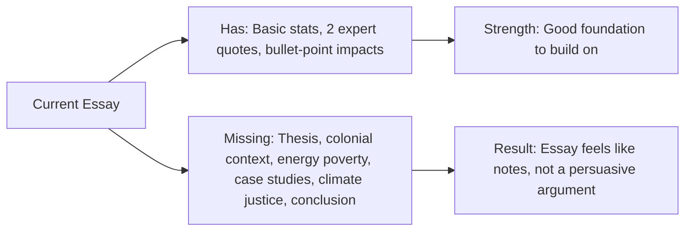

# Brainstorm: Africa & Climate Change Essay

## 🔍 What the Essay Currently Has

| Section | Content Present | Approx. Length |
|---|---|---|
| **Introduction** | Defines climate change, names top emitters (China, US, India), lists general effects | ~1 paragraph |
| **Why Africa contributes least** | 4% of emissions, per-capita stats, comparison with the US, quote from Siri Eriksen on converging stressors, quote from Anthony Nyong on health/development tradeoff | ~4 paragraphs |
| **Why Africa suffers most** | Rain-fed agriculture, low adaptive capacity, faster warming, weak early warning systems, economic vulnerability | ~1 paragraph (bullet list) |
| **Conclusion** | ❌ Missing entirely | — |

---

## ⚠️ Key Problems to Fix

### 1. Structure & Flow
- **No clear thesis statement.** The intro describes climate change generally but never states the essay's argument upfront (i.e., "This essay argues that Africa's minimal contribution to climate change contrasts sharply with its disproportionate vulnerability due to X, Y, Z").
- **Lopsided body.** The "why Africa contributes least" section is ~4 paragraphs with expert quotes, but the "why Africa suffers most" section is just a rushed bullet list — it needs equal depth and narrative weight.
- **No conclusion.** The essay stops abruptly after the bullet points. A strong conclusion is essential.
- **No transitions.** The shift from "low contribution" to "high vulnerability" is jarring — needs a bridging paragraph.

### 2. Content Gaps

> [!IMPORTANT]
> These are the biggest opportunities to strengthen the essay:

| Gap | What to Add |
|---|---|
| **Historical context** | Africa was colonised and its economies were structured around raw material extraction — not industrialisation. This is WHY emissions are low. Tie low emissions to colonial economic legacies, not just "Africa doesn't have heavy industry." |
| **Energy poverty** | ~600 million Africans lack access to electricity (IEA). You can't emit carbon if you don't have power. This is a powerful point. |
| **Climate justice / ethical framing** | The essay hints at "cruel irony" but never names the concept of **climate justice** or the **polluter pays principle**. This is the intellectual backbone of the argument. |
| **Specific case studies** | The Eriksen quote mentions the 2002 southern Africa famine — good. But add 1-2 more concrete examples: e.g., Lake Chad shrinking by 90%, Cyclone Idai (Mozambique 2019), Horn of Africa drought 2022. |
| **Health impacts (expanded)** | Nyong mentions malaria/dengue briefly. Expand: WHO estimates climate change will cause 250,000 additional deaths per year in Africa between 2030-2050. |
| **Displacement & migration** | Climate-driven displacement is massive in Africa. The World Bank projects up to 86 million internal climate migrants in Sub-Saharan Africa by 2050. |
| **Loss and damage / COP negotiations** | Africa's fight at COP27 (Sharm el-Sheikh) for the Loss and Damage Fund is directly relevant. Shows the political dimension. |
| **Gender & inequality** | Women and girls bear disproportionate climate burdens in Africa (water collection, agricultural labour). Adds analytical depth. |

### 3. Source Quality & Data Freshness

> [!WARNING]
> The current data is outdated and needs updating.

- The essay cites **U.S. DOE International Energy Annual 2002** — this is **24 years old**. Use current data from the **IEA World Energy Outlook 2024** or **Global Carbon Project 2024**.
- The U.S. figure of "5.7 billion metric tons" and "23% of world's total" is from the early 2000s. China has since surpassed the US. Update accordingly.
- South Africa's per-capita figure of 8.44 metric tons needs a current source (it's now ~7.0 t/CO₂ per capita).
- Add IPCC AR6 (2021-2023) findings — the most authoritative current source on Africa's climate vulnerability.

### 4. Writing Style Issues
- **Repetition:** The "less than 4% of emissions" fact appears twice in quick succession.
- **Inconsistent tone:** The intro reads like a textbook definition, but the body has strong journalistic quotes. Unify the register.
- **Random capitalisation:** "Reliance," "Agriculture," "Capacity," "Price," "Rates," "Population," "GDP" — some are capitalised mid-sentence for no reason.
- **Bullet list in body:** The "reasons Africa pays severely" section reads like notes, not essay prose. Convert to full paragraphs with evidence and analysis.

---

## ✅ Proposed Revised Outline

### I. Introduction (≈200 words)
- Hook: A striking statistic or image (e.g., "Lake Chad, once one of Africa's largest freshwater bodies, has shrunk by 90% since the 1960s…")
- Define climate change briefly (1-2 sentences, not a full paragraph)
- **Thesis statement:** "Although Africa contributes less than 4% of global greenhouse gas emissions, it bears the heaviest burden of climate change impacts — a disparity rooted in colonial economic legacies, energy poverty, and systemic inequities in global climate governance."

---

### II. Why Africa Is the Least Contributor (≈400–500 words)
Structure around **three sub-arguments:**

1. **Colonial economic legacy → no industrialisation**
   - Africa's economies were structured for extraction, not manufacturing
   - Post-independence, most nations inherited agrarian economies
   - Low industrial output = low emissions

2. **Energy poverty**
   - ~600M without electricity access (IEA 2023)
   - Per-capita emissions: Africa avg ~1 tCO₂ vs. US ~14 tCO₂ vs. China ~8 tCO₂
   - Even the most industrialised (South Africa, Nigeria, Egypt) emit a fraction of OECD nations

3. **Economic structure**
   - Agriculture, informal sector, and services dominate
   - Minimal heavy manufacturing, petrochemical, or coal-intensive power generation (except South Africa)
   - Low per-capita energy consumption

---

### III. Transition Paragraph (≈50–80 words)
- "Yet this minimal contribution offers no shield against the consequences. In a bitter paradox, the continent least responsible for heating the planet stands most exposed to its effects."

---

### IV. Why Africa Suffers the Most (≈500–600 words)
Structure around **five sub-arguments**, each as a full paragraph:

1. **Dependence on rain-fed agriculture**
   - 70% livelihood dependency
   - Shifting rainfall → crop failure → food insecurity
   - Case study: Sahel droughts, East Africa 2022

2. **Accelerated warming & extreme weather**
   - Africa warming at 0.3°C/decade (faster than global avg)
   - Increased frequency of cyclones (Idai, Freddy), floods, and droughts
   - Lake Chad as a visual symbol

3. **Health crises amplified**
   - Malaria, dengue, cholera expansion
   - WHO: 250,000 additional deaths/year projected (2030–2050)
   - Converging with HIV/AIDS (Eriksen quote fits here)

4. **Weak infrastructure & low adaptive capacity**
   - Only 40% have early warning access
   - Limited irrigation, flood defenses, climate-resilient housing
   - Poverty constrains adaptation spending

5. **Economic & displacement toll**
   - 2–5% GDP loss annually
   - World Bank: 86M internal climate migrants by 2050
   - Development gains reversed (Nyong quote fits here)

---

### V. The Climate Justice Dimension (≈150–200 words)
- Introduce the concept of **climate justice** and the **polluter pays principle**
- Africa's advocacy at COP27 for the Loss and Damage Fund
- The ethical argument: those who caused the crisis must fund adaptation
- Brief mention of gender-differentiated impacts

---

### VI. Conclusion (≈150 words)
- Restate thesis in fresh language
- Emphasise the moral imperative
- Forward-looking: what must change (scaled-up climate finance, technology transfer, African-led adaptation)
- Closing line: powerful, memorable

---

## 🔑 Summary of What's Missing vs. What's There

## 📋 Immediate Next Steps

1. **Agree on the revised outline above** — any sections Chris wants to add/remove?
2. **Decide on essay length target** — is this a 1,500-word essay? 2,000? 3,000?
3. **Confirm referencing style** — APA 7th? Harvard? MLA?
4. **Proceed to drafting** section by section once structure is approved.
