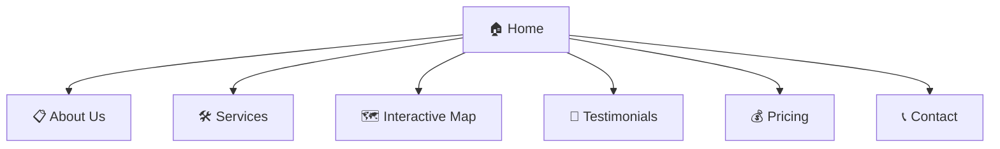

# GeoResilience Hub — Phase 1 Implementation Plan

**Project:** GeoResilience Hub Website  
**Founders:** Emmanuel Yerbo & Gifty Gyamera-Annor  
**Date:** May 11, 2026  
**Status:** Phase 1 — Approved for Implementation  

---

## 1. Project Overview

**GeoResilience Hub** is a two-person geospatial consulting firm offering GIS, drone mapping, and flood risk solutions to NGOs, government agencies, real estate developers, and researchers across Ghana and West Africa.

### The Team

| Name | Specialization |
|---|---|
| Emmanuel Yerbo | GIS & Remote Sensing, Flood Mapping, GeoAI, Hydrology |
| Gifty Gyamera-Annor | GIS Mapping, Land & Urban Planning, Spatial Data Support |

**Contact:**
- Email: giftygyameraannor32@gmail.com / emmanuelyerbo@gmail.com
- Phone: 0556834650 / +233553776346

> [!NOTE]
> All text, images, logos, and testimonials are **placeholders** for Phase 1. Real content will be swapped in later. All placeholders will be marked with `<!-- PLACEHOLDER -->` comments in the HTML for easy find-and-replace.

---

## 2. Competitive Analysis

Two established Ghanaian geospatial firms were analyzed as benchmarks:

### 2.1 Sambus Geospatial ([sambusgeospatial.com](https://sambusgeospatial.com))

| Aspect | What They Do | Our Takeaway |
|---|---|---|
| **Scale** | Sole Esri distributor in West Africa, offices in Ghana & Nigeria | Enterprise-level. We position as agile, research-driven alternative |
| **Navigation** | Deep mega-menu: Home, About (History, Team, Projects, Alliances), Solutions, Products & Services (Esri, Trimble, NV5, Wingtra, Training, Consultancy, Support), Blog, Careers, Contact | Too complex for a 2-person firm. We keep it lean — 7 pages max |
| **Testimonials** | 8 named client testimonials with org + title (e.g. Ghana Health Service, GNPC, Voltic Ghana, NBS Nigeria) | Strong social proof. We need placeholder testimonials that feel equally specific |
| **Products** | Heavy focus on Esri product reselling (ArcGIS Desktop, Online, Enterprise) | We don't resell products — we sell analytical services. Different value prop |
| **Design** | Corporate, image-heavy hero sliders. Light mode only. No dark mode | **Opportunity: our dark mode will feel more modern and tech-forward** |
| **Interactive Maps** | None on the website | **Major opportunity: our GEE flood map is a differentiator** |
| **Pricing** | No pricing shown — "Contact Us" model | We show transparent tiers to lower friction for smaller clients |

### 2.2 AccuGeospatial ([accugeospatial.com](https://accugeospatial.com))

| Aspect | What They Do | Our Takeaway |
|---|---|---|
| **Scale** | Esri Silver Partner, East Legon, Accra | Established but narrow product focus |
| **Navigation** | Home, About, Services, Products, Global Partners, Events, Contact | Clean structure, good model to follow |
| **App Showcase** | Featured GIS apps: Tour Ghana, Ghana Health Facility Locator, Galamsey Menace — linking to ArcGIS StoryMaps/Dashboards | **Key inspiration: feature our GEE Interactive Map the same way — prominent homepage showcase** |
| **Client Logos** | Partner/client logo slider (MTN, EPA, Cargill) | We add a "Who We Work With" section with client-type icons |
| **Design** | Forest green (#2E7D32) + white. Elementor/WordPress. Clean but conventional | **Opportunity: our glassmorphism + dark mode will feel substantially more premium** |
| **Dark Mode** | None | **Advantage: ours** |
| **Pricing** | No pricing page — B2B contact model | **Advantage: transparent pricing tiers** |
| **Training** | Dedicated training/events section | We can add this in Phase 2 |

### Competitive Advantages for GeoResilience Hub

```
✅ Dark / Light mode toggle — neither competitor has this
✅ GEE Interactive Flood Map — neither embeds live geospatial tools
✅ Transparent pricing tiers — both competitors use opaque "contact us"
✅ Modern glassmorphism UI — competitors use standard WordPress themes
✅ Research-backed credibility — published flood susceptibility study
✅ Lean & agile — direct service, no product reselling overhead
```

---

## 3. Site Architecture — 7 Pages



### 3.1 Home (Landing Page)
- **Hero section:** Full-width banner with tagline *"Turning Spatial Data into Real-World Solutions"*, animated particle/contour background, dual CTA buttons ("Explore Services" / "Try Our Flood Map")
- **App Showcase strip** *(inspired by AccuGeospatial)*: Prominent visual card linking to the GEE Interactive Flood Map — this is our headline differentiator
- **Service overview:** 3 pillar cards (Flood & Environmental, Land & Urban Planning, GIS Mapping & Data Support)
- **"Meet the Team" teaser:** Partner photos + names + one-liner, linking to About
- **Stats counter:** Animated counters (e.g., "50+ Projects", "10+ Districts Served", "30+ ESRI Certifications")
- **"Who We Work With" strip** *(inspired by Sambus logos section)*: NGOs, Government, Real Estate, Researchers — shown as icon categories
- **Testimonial preview:** 1–2 featured quotes from the Testimonials page
- **CTA banner:** "Ready to map your next project?" → Contact

### 3.2 About Us
- Company story, mission, and vision
- **Individual partner profiles** with photos, qualifications, and specializations
- **Certifications & tools grid:** ESRI certs (30+), ArcGIS Pro, QGIS, GEE, Pix4D, ENVI
- **"Who We Work With" section:** NGOs & Environmental Projects, Government & District Assemblies, Real Estate Developers, Researchers & Students
- GitHub and LinkedIn links

### 3.3 Services
Three service categories, each with:
- Description, deliverables list, sample image, tools used

| Category | Sub-services |
|---|---|
| **Flood & Environmental** | Flood Risk Mapping, Environmental Change Detection, Water & Water Risk Analysis |
| **Land & Urban Planning** | Land Use / Land Cover Mapping, Site Suitability Analysis, Urban Expansion Analysis |
| **GIS Mapping & Data Support** | Map Design for Reports, Research & Thesis GIS Support, Spatial Data Analysis |

- Each card expands on click to show detail + sample deliverable image
- "What You Get" summary: Clear and professional maps, Accurate spatial insights, Decision-support reports, Reliable delivery

### 3.4 Interactive Map (GEE Flood Vulnerability Rater) ⭐
**The centerpiece feature that no competitor offers.**

- Embedded Google Earth Engine app showing the Volta Region flood susceptibility map
- Layer toggles: Elevation, Slope, HAND, Flood Frequency, LULC, Distance to Water
- Color-coded risk zones: 🟢 Low → 🟡 Medium → 🔴 High
- **Click-to-query:** User clicks any location → popup shows flood vulnerability rating with factor breakdown
- Info panel explaining the 6 conditioning factors and methodology
- Link to the published writing sample / research paper
- "Need a flood assessment for your area? Contact us." CTA

### 3.5 Testimonials
- 4 placeholder testimonial cards *(styled similarly to Sambus's named testimonials)*:
  - Client name, organization, role
  - Quote text
  - Star rating (4–5 stars)
  - Project type tag (e.g., "Flood Mapping", "Land Use Analysis")
- Carousel/slider with auto-play
- CTA: "Want to be our next success story?"

### 3.6 Pricing
- **Three-tier pricing cards** *(neither competitor offers transparent pricing)*:
  - **Basic** — Single map production, report-ready cartographic output
  - **Standard** — Multi-layer spatial analysis (site suitability, flood mapping, LULC)
  - **Premium** — Full project lifecycle: data collection, multi-criteria analysis, interactive deliverables
- "Custom Quote" button → links to Contact form
- FAQ accordion: turnaround times, data requirements, revision policy, file formats

### 3.7 Contact
- **Contact form:** Name, Email, Organization, Service Interest (dropdown), Message
- **Direct contact info** for both partners (email + phone)
- **Embedded Google Maps** showing Cape Coast, Ghana
- Social links: LinkedIn, GitHub

---

## 4. Design System

### Color Palette

| Token | Dark Mode | Light Mode | Usage |
|---|---|---|---|
| `--bg-primary` | `#0f1117` | `#ffffff` | Page background |
| `--bg-secondary` | `#1a1d27` | `#f4f5f7` | Card/section backgrounds |
| `--bg-glass` | `rgba(26,29,39,0.7)` | `rgba(255,255,255,0.7)` | Glassmorphism panels |
| `--accent-green` | `#2ecc71` | `#27ae60` | Primary accent, CTAs |
| `--accent-gold` | `#f0c040` | `#d4a017` | Highlights, ratings |
| `--text-primary` | `#e8e8e8` | `#1a1a2e` | Body text |
| `--text-secondary` | `#8b8fa3` | `#6b7280` | Muted text |
| `--risk-low` | `#27ae60` | `#27ae60` | Map: low risk |
| `--risk-medium` | `#f39c12` | `#f39c12` | Map: medium risk |
| `--risk-high` | `#e74c3c` | `#e74c3c` | Map: high risk |

### Typography
- **Headings:** `'Outfit', sans-serif` (Google Fonts)
- **Body:** `'Inter', sans-serif` (Google Fonts)

### UI Principles
- Glassmorphism cards with `backdrop-filter: blur(12px)`
- Gradient borders on hover (green → gold)
- Micro-animations: fade-in on scroll (Intersection Observer), counter animations, hover lifts
- Smooth page transitions
- Mobile-first: breakpoints at 768px, 1024px, 1440px
- Dark mode toggle (sun/moon icon) with `localStorage` persistence

---

## 5. Tech Stack

| Layer | Technology | Rationale |
|---|---|---|
| Structure | HTML5 | Semantic, accessible |
| Styling | Vanilla CSS (custom properties) | Full control, no framework bloat |
| Logic | Vanilla JS (ES6+) | Dark mode, animations, form handling |
| Maps | GEE JS API (embedded `<iframe>`) | Direct GEE app embed for flood map |
| Fonts | Google Fonts (Outfit, Inter) | Premium typography |
| Icons | Lucide Icons (CDN) | Clean iconography |
| Hosting | GitHub Pages (Phase 1) | Free, version-controlled |
| Forms | Formspree or EmailJS | Serverless form submission |

> [!IMPORTANT]
> No frameworks needed. Pure HTML/CSS/JS keeps the site fast and easy to maintain for a two-person team.

---

## 6. Placeholder Content Strategy

| Content Type | Placeholder Approach | Replace When |
|---|---|---|
| Logo | CSS-styled text "GeoResilience Hub" with icon | Client provides logo file |
| Team photos | AI-generated headshots | Real photos provided |
| Bios | Written from profile data | Partners review/edit |
| Testimonials | 4 realistic fictional quotes with names/orgs | Real testimonials come in |
| Pricing | Industry-standard tier structure | Partners confirm rates |
| Service images | AI-generated geospatial visuals | Project portfolio images provided |
| Stats | Approximate figures | Partners confirm actuals |

---

## 7. GEE Interactive Map — Technical Approach

### Phase 1: GEE App Embed (Recommended)
- Adapt existing Volta Region flood susceptibility GEE code into a `ui.Map()` + `ui.Panel()` app
- Publish via `ee.apps` and embed in `<iframe>` on the Maps page
- Features: layer toggles, click-to-query, color-coded legend, methodology panel
- **Pros:** Fastest to build, reuses existing code
- **Cons:** Limited styling control within the GEE UI

### Phase 2: Custom Leaflet/MapLibre (Future)
- Export GEE layers as COG or tile services
- Full custom map with branded UI, popups, downloadable reports

---

## 8. Time Estimate

### Detailed Breakdown

| # | Task | Hours |
|---|---|---|
| 1 | Design system setup (CSS tokens, typography, dark/light toggle, base reset) | 3 |
| 2 | Navbar & Footer (responsive nav, hamburger menu, dark mode switch, footer) | 2.5 |
| 3 | Home page (hero, app showcase, service cards, team teaser, stats, CTAs) | 5 |
| 4 | About page (profiles, certs grid, "Who We Work With") | 3 |
| 5 | Services page (3 category cards, expandable details, sample images) | 3.5 |
| 6 | Interactive Map page (GEE App build + embed, info panel, CTA) | 6 |
| 7 | Testimonials page (carousel, placeholder cards, star ratings) | 2.5 |
| 8 | Pricing page (3-tier cards, FAQ accordion, custom quote CTA) | 3 |
| 9 | Contact page (form + validation, Formspree/EmailJS, Google Maps embed) | 3 |
| 10 | Image generation (hero banner, service visuals, team photos, backgrounds) | 2 |
| 11 | Responsive polish (mobile/tablet breakpoints, touch interactions, testing) | 3 |
| 12 | Dark/Light mode QA (full theme toggle tested across all 7 pages) | 1.5 |
| 13 | SEO & meta (title tags, descriptions, Open Graph, semantic HTML audit) | 1 |

### Summary

| Metric | Estimate |
|---|---|
| **Total Development Hours** | **38 – 48 hours** |
| **Working Days (6–8 hrs/day)** | **5 – 7 days** |
| **Calendar Days (realistic)** | **7 – 10 days** |

### Build Order

```
Day 1 ──► Design system + Navbar/Footer + Home page structure
Day 2 ──► Home page polish + About page
Day 3 ──► Services page + Pricing page
Day 4 ──► Contact page + Testimonials page
Day 5 ──► GEE Interactive Map (build GEE App + embed)
Day 6 ──► Image generation + Responsive polish
Day 7 ──► Dark/light mode QA + SEO + Final testing
```

> [!TIP]
> The GEE Interactive Map (~6 hrs) is the most complex single task. If your existing GEE flood code is well-structured, it could come in at ~4 hours. Everything else is standard web development.

---

## 9. Phase 2 Roadmap (Future)

- Custom Leaflet/MapLibre map replacing GEE iframe
- Blog / Case Studies section
- Real testimonials and project portfolio
- Logo integration
- Training / Events page *(inspired by AccuGeospatial)*
- Analytics (Google Analytics / Plausible)
- Custom domain + professional hosting
- PDF report generation from map queries
- Projects & Achievements page *(inspired by Sambus)*

---

## 10. Decisions Needed Before Build

| # | Decision | Notes |
|---|---|---|
| 1 | Logo file | PNG/SVG — coming later |
| 2 | Real team photos | Professional headshots preferred |
| 3 | Pricing tiers | Confirm rates for Basic / Standard / Premium |
| 4 | Contact form destination | Which email(s) receive form submissions? |
| 5 | Domain name | georesiliencehub.com? georesiliencehub.org? |
| 6 | Real testimonials | Client names, quotes, org names when available |
| 7 | GEE account | Which Google account publishes the GEE App? |

---

> **✅ Plan complete. Say the word and we start building Day 1.**
