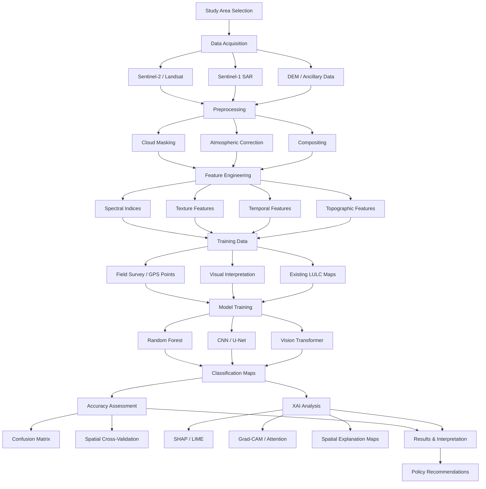

# Brainstorming: Explainable AI-Based LULC Classification in Ghana

> **Purpose**: Map out every key component of this research *before* diving into literature. This ensures we enter the literature search with clear questions and a strong conceptual framework.

---

## 1. Why This Research Matters

### The Core Problem
Land Use Land Cover (LULC) classification using machine learning and deep learning has become highly accurate — but these models often operate as **black boxes**. Decision-makers (planners, policymakers, environmental agencies) need to:
- **Trust** the classification outputs before acting on them
- **Understand** *why* a pixel/region was classified as a particular land cover type
- **Diagnose** misclassifications and model failures
- **Validate** that the model is learning ecologically meaningful patterns, not spurious correlations

### Why Ghana Specifically?
- **Diverse ecological zones**: Coastal savanna, tropical rainforest, Guinea savanna, Sudan savanna, and transitional zones — each with distinct LULC dynamics
- **Rapid land use change**: Urbanization (Accra, Kumasi), illegal mining (galamsey), deforestation, agricultural expansion
- **Policy relevance**: Ghana's commitments to REDD+, SDGs (especially 11, 13, 15), and national spatial development frameworks
- **Data gap**: Limited XAI-focused remote sensing studies in West Africa / Sub-Saharan Africa
- **Ground truth availability**: Existing datasets from Ghana Statistical Service, Forestry Commission, and open-source LULC products (ESA WorldCover, Dynamic World)

---

## 2. Study Area Considerations

### Option A: National Scale
- Full coverage of Ghana's ecological diversity
- Challenges: computational cost, heterogeneous landscapes, variable ground truth quality
- Best for: broad generalizations, policy-level insights

### Option B: Regional / Ecological Zone Focus
| Zone | Key LULC Dynamics | Research Appeal |
|------|-------------------|-----------------|
| Greater Accra Metro | Rapid urbanization, coastal erosion | Urban-focused XAI study |
| Ashanti / Western Regions | Cocoa farming, illegal mining, deforestation | Forest degradation narratives |
| Northern Savanna | Cropland expansion, bush burning, desertification | Climate vulnerability angle |
| Transitional Zone | Mixed forest-savanna, diverse agriculture | Ecotone classification challenges |
| Volta Region | Wetlands, water bodies, mixed land use | Wetland mapping with XAI |

### Option C: Multi-Site Comparative
- Select 2-3 contrasting ecological zones
- Compare how XAI explanations differ across landscapes
- Strongest research contribution — shows how model reasoning varies by ecology

> [!TIP]
> A **multi-site comparative** approach (e.g., coastal urban vs. forest vs. savanna) would give the richest results and the strongest novelty for publication.

---

## 3. Remote Sensing Data Sources

### Satellite Imagery
| Sensor | Resolution | Strengths | Considerations |
|--------|-----------|-----------|----------------|
| **Sentinel-2** | 10m (VNIR), 20m (SWIR) | Free, 5-day revisit, 13 bands | Best balance of resolution & spectral range |
| **Landsat 8/9** | 30m | Long archive (since 1972), thermal band | Lower resolution but excellent for change detection |
| **PlanetScope** | 3m | Very high resolution, daily revisit | Commercial — cost may be prohibitive |
| **MODIS** | 250-1000m | Daily global coverage | Too coarse for fine-scale LULC |
| **SAR (Sentinel-1)** | 10m | Cloud-penetrating, structural info | Complementary to optical — good for tropical Ghana |

### Derived Features & Indices
- **Spectral indices**: NDVI, NDBI, NDWI, SAVI, EVI, NDMI, BSI
- **Texture features**: GLCM (contrast, entropy, homogeneity, correlation)
- **Temporal composites**: Seasonal medians, harmonic coefficients, phenological metrics
- **Topographic features**: DEM-derived slope, aspect, elevation (SRTM/ALOS)
- **SAR features**: VV/VH backscatter, VV/VH ratio, radar vegetation index

### Existing LULC Products (for comparison / validation)
- ESA WorldCover (10m, 2020/2021)
- Google Dynamic World (10m, near real-time)
- ESRI Land Cover (10m)
- Copernicus Global Land Cover (100m)
- Ghana-specific maps from Forestry Commission

> [!IMPORTANT]
> **Cloud cover** is a major challenge in tropical Ghana, especially in the forest zone. Consider using:
> - Cloud-free composites (median/percentile)
> - SAR fusion to fill optical gaps
> - Dry-season imagery windows (November–March)

---

## 4. LULC Classification Scheme

### What classes to map?
A robust classification scheme is critical. Consider a **hierarchical** approach:

**Level 1 (Broad)**
1. Built-up / Urban
2. Cropland / Agriculture
3. Forest / Vegetation
4. Water Bodies
5. Bare Land / Exposed Surface
6. Wetland / Mangrove

**Level 2 (Detailed)**
1. Dense Urban, Peri-urban, Rural Settlement
2. Irrigated Cropland, Rainfed Cropland, Plantation (cocoa, oil palm)
3. Closed Forest, Open Forest, Shrubland, Grassland
4. Rivers, Lakes/Reservoirs, Ponds
5. Bare Soil, Rock Outcrop, Mining Sites
6. Herbaceous Wetland, Mangrove, Floodplain

> [!NOTE]
> The classification scheme should align with **national standards** (e.g., Ghana Forestry Commission categories) or **international standards** (FAO LCCS, IPCC) for comparability and policy relevance.

---

## 5. Machine Learning / Deep Learning Models

### Traditional ML (Pixel-based)
| Model | Pros | Cons |
|-------|------|------|
| **Random Forest (RF)** | Robust, handles mixed features, built-in feature importance | No spatial context |
| **Gradient Boosting (XGBoost/LightGBM)** | High accuracy, SHAP-compatible | Same pixel-level limitation |
| **Support Vector Machine (SVM)** | Good for small training sets | Computationally expensive, less interpretable |

### Deep Learning (Spatial-aware)
| Model | Pros | Cons |
|-------|------|------|
| **1D-CNN** | Learns spectral patterns, lightweight | No spatial context |
| **2D-CNN / ResNet** | Learns spatial-spectral patterns from image patches | Needs patch extraction pipeline |
| **U-Net / SegNet** | Semantic segmentation, pixel-wise output | Needs labeled masks, GPU-intensive |
| **Vision Transformer (ViT)** | State-of-the-art, attention is inherently interpretable | Data-hungry, computationally expensive |
| **Hybrid CNN-Transformer** | Combines local + global context | Complex architecture |

### Modeling Strategy
- **Baseline**: Random Forest (well-understood, easy XAI)
- **Advanced**: Deep learning model (CNN, U-Net, or Transformer)
- **Comparison**: How do XAI explanations differ between ML and DL models?

> [!TIP]
> A strong research design would compare **RF vs. CNN vs. Transformer** and then apply XAI to each — showing how explanations change with model complexity. This is a publishable contribution on its own.

---

## 6. Explainable AI (XAI) — The Core Innovation

### Why XAI for LULC?
1. **Scientific understanding**: Which spectral bands/features actually drive classification?
2. **Trust building**: Can non-technical stakeholders (planners, farmers) trust AI maps?
3. **Error diagnosis**: Why does the model confuse cropland with savanna?
4. **Feature selection**: Can XAI guide us to more efficient feature sets?
5. **Ecological validation**: Do the model's reasons align with domain knowledge?

### XAI Method Categories

#### A. Model-Agnostic Methods (work with any model)
| Method | What It Does | Best For |
|--------|-------------|----------|
| **SHAP (SHapley Additive exPlanations)** | Assigns contribution values to each feature for each prediction | Feature importance, both global and local |
| **LIME (Local Interpretable Model-agnostic Explanations)** | Approximates model locally with a simple model | Understanding individual predictions |
| **Permutation Feature Importance** | Measures accuracy drop when a feature is shuffled | Global feature ranking |
| **Partial Dependence Plots (PDP)** | Shows marginal effect of a feature on prediction | Understanding feature-class relationships |
| **Accumulated Local Effects (ALE)** | Like PDP but handles correlated features | More robust feature effect estimation |

#### B. Deep Learning-Specific Methods
| Method | What It Does | Best For |
|--------|-------------|----------|
| **Grad-CAM / Grad-CAM++** | Highlights image regions driving CNN decisions | Spatial attribution maps |
| **Attention Maps** | Visualizes where Transformers "look" | Understanding spatial focus of ViTs |
| **Integrated Gradients** | Attributes prediction to input features via gradient integration | Pixel-level attribution |
| **Layer-wise Relevance Propagation (LRP)** | Backpropagates relevance scores through layers | Fine-grained pixel attribution |
| **Saliency Maps** | Gradient of output w.r.t. input | Quick visual explanations |
| **Occlusion Sensitivity** | Masks parts of input and measures prediction change | Spatial importance without gradients |

#### C. Inherently Interpretable Models
- **Decision Trees** (limited accuracy)
- **Attention-based architectures** (Transformers with attention visualization)
- **Rule-based classifiers** (highly interpretable but less flexible)

### XAI Analysis Framework
```
┌─────────────────────────────────────────────────┐
│                XAI ANALYSIS LEVELS              │
├─────────────────────────────────────────────────┤
│                                                 │
│  GLOBAL EXPLANATIONS                            │
│  ├── Which features matter most overall?        │
│  ├── SHAP summary plots                         │
│  ├── Permutation importance                     │
│  └── PDP / ALE plots                            │
│                                                 │
│  CLASS-LEVEL EXPLANATIONS                       │
│  ├── What distinguishes Forest from Cropland?   │
│  ├── Per-class SHAP values                      │
│  └── Confusion-pair analysis                    │
│                                                 │
│  LOCAL / PIXEL-LEVEL EXPLANATIONS               │
│  ├── Why was THIS pixel classified as Urban?    │
│  ├── LIME for individual predictions            │
│  ├── Grad-CAM spatial heatmaps                  │
│  └── Attention maps for Transformers            │
│                                                 │
│  SPATIAL EXPLANATIONS                           │
│  ├── Do explanations vary geographically?       │
│  ├── Explanation maps across the study area     │
│  └── Ecological zone comparison                 │
│                                                 │
└─────────────────────────────────────────────────┘
```

> [!IMPORTANT]
> The **spatial explanation** level — mapping how feature importance changes across geography — is a particularly novel angle. Most XAI-LULC studies stop at global/local. Showing that "NDVI matters most in savanna but NDBI matters most in urban areas" would be a strong contribution.

---

## 7. Potential Research Questions

### Primary RQ
> *How can Explainable AI methods enhance the transparency and trustworthiness of deep learning-based LULC classification in Ghana?*

### Secondary RQs
1. **Feature Importance**: Which spectral, spatial, and temporal features are most influential in classifying different LULC types across Ghana's ecological zones?
2. **Model Comparison**: How do XAI explanations differ between traditional ML (RF) and deep learning (CNN/Transformer) classifiers?
3. **Spatial Variation**: How does the relative importance of classification features vary across different ecological zones in Ghana?
4. **Misclassification Diagnosis**: Can XAI methods identify and explain systematic misclassification patterns (e.g., cropland ↔ grassland confusion)?
5. **Stakeholder Trust**: To what extent do XAI-generated explanations improve end-user confidence in AI-derived LULC maps?
6. **Feature Optimization**: Can XAI-driven feature selection improve classification accuracy and computational efficiency?

---

## 8. Methodological Pipeline



---

## 9. Training Data Strategy

### Sources of Ground Truth
| Source | Pros | Cons |
|--------|------|------|
| **Field GPS surveys** | Most reliable, firsthand | Expensive, time-consuming, limited coverage |
| **Google Earth / VHR imagery interpretation** | Free, wide coverage | Subjective, temporal mismatch possible |
| **Existing LULC products** | Ready-made, large sample | May contain errors, different class definitions |
| **OpenStreetMap** | Community-contributed, free | Inconsistent coverage in rural Ghana |
| **Crowdsourced platforms** (Collect Earth, LACO-Wiki) | Scalable | Quality control challenges |

### Sampling Design
- **Stratified random sampling** across all LULC classes
- Ensure representation across **all ecological zones**
- Minimum sample size: ~50-100 points per class (more for heterogeneous classes)
- **Spatial blocking** for cross-validation (avoid spatial autocorrelation leakage)

> [!WARNING]
> **Spatial autocorrelation** is a known issue in LULC validation. Standard random train/test splits inflate accuracy. Use **spatial block cross-validation** (which you've already explored in your precision agriculture work) to ensure honest accuracy estimates.

---

## 10. Validation & Accuracy Assessment

### Classification Accuracy
- Overall Accuracy (OA)
- Kappa Coefficient
- Per-class Precision, Recall, F1-Score
- User's & Producer's Accuracy
- Area-weighted accuracy (for class imbalance)

### XAI Evaluation (How do you validate explanations?)
This is a **cutting-edge** and **under-explored** area:

| Metric/Approach | Description |
|-----------------|-------------|
| **Faithfulness** | Do explanations truly reflect model behavior? (Perturbation tests) |
| **Stability** | Are explanations consistent for similar inputs? |
| **Plausibility** | Do explanations align with domain expert knowledge? |
| **Comprehensibility** | Can end-users understand the explanations? (User studies) |
| **Selectivity** | Are explanations sparse enough to be useful? |

> [!TIP]
> Including a **domain expert evaluation** component (surveying ecologists, planners, GIS analysts) on the quality of XAI outputs would significantly strengthen the research and is rarely done in remote sensing XAI studies.

---

## 11. Tools & Platforms

### Data Processing
| Tool | Use Case |
|------|----------|
| **Google Earth Engine (GEE)** | Cloud-based satellite image processing, compositing |
| **Python (rasterio, GDAL)** | Local raster processing |
| **QGIS** | Visualization, ground truth digitization |

### Machine Learning
| Tool | Use Case |
|------|----------|
| **scikit-learn** | RF, SVM, preprocessing pipelines |
| **PyTorch / TensorFlow** | CNN, U-Net, Transformer training |
| **XGBoost / LightGBM** | Gradient boosting classifiers |

### Explainable AI
| Tool | Use Case |
|------|----------|
| **SHAP** (`shap` Python library) | SHAP values for any model |
| **LIME** (`lime` Python library) | Local explanations |
| **Captum** (PyTorch) | Integrated Gradients, Grad-CAM, LRP for deep learning |
| **tf-explain** (TensorFlow) | Grad-CAM, occlusion for TF models |
| **InterpretML** | Unified interpretability framework |

### Compute
- **Google Colab Pro** (GPU access, free tier available)
- **Kaggle Notebooks** (free GPU)
- **University HPC** (if available)
- **AWS/GCP** (scalable but costs money)

---

## 12. Potential Research Gaps to Fill

Based on general knowledge (to be confirmed with literature):

1. **Geographic gap**: Very few XAI-LULC studies focus on **West Africa or Ghana specifically**
2. **Ecological diversity**: No study comparing XAI explanations **across multiple ecological zones** within one country
3. **SAR + Optical fusion**: Limited XAI analysis on **multi-sensor** LULC classification
4. **Temporal XAI**: How do feature importances change **across seasons** or **over time**?
5. **Stakeholder validation**: Almost no studies validate XAI outputs with **domain experts or end-users**
6. **Multi-scale XAI**: Comparing explanations at different spatial resolutions (10m vs 30m)
7. **XAI for error correction**: Using explanations to **iteratively improve** training data or model architecture
8. **Transformer attention for LULC**: Very new — spatial attention in Vision Transformers for land cover is barely explored

---

## 13. Potential Publication Outlets

| Journal | Impact | Fit |
|---------|--------|-----|
| *Remote Sensing of Environment* | Very High | Premier RS journal |
| *ISPRS Journal of Photogrammetry and Remote Sensing* | Very High | Strong ML-RS fit |
| *International Journal of Applied Earth Observation and Geoinformation* | High | Applied RS + AI |
| *Remote Sensing* (MDPI) | Medium-High | Open access, fast review |
| *IEEE Transactions on Geoscience and Remote Sensing* | Very High | Technical depth |
| *Ecological Informatics* | Medium | Ecology + AI crossover |
| *Environmental Modelling & Software* | High | Environmental applications |
| *Computers & Geosciences* | Medium | Geospatial computing |

---

## 14. Preliminary Research Framework Summary

```
┌──────────────────────────────────────────────────────────────┐
│         XAI-BASED LULC CLASSIFICATION IN GHANA               │
├──────────────────────────────────────────────────────────────┤
│                                                              │
│  INPUT DATA                                                  │
│  • Sentinel-2 (optical) + Sentinel-1 (SAR)                   │
│  • Derived indices + texture + topography                    │
│                                                              │
│  STUDY AREAS                                                 │
│  • 2-3 ecological zones (comparative design)                 │
│                                                              │
│  MODELS                                                      │
│  • Random Forest (baseline)                                  │
│  • CNN / U-Net (deep learning)                               │
│  • Vision Transformer (state-of-the-art)                     │
│                                                              │
│  XAI METHODS                                                 │
│  • SHAP (global + local, all models)                         │
│  • Grad-CAM (CNN/U-Net)                                      │
│  • Attention Maps (Transformer)                              │
│  • Spatial explanation mapping (novel)                        │
│                                                              │
│  VALIDATION                                                  │
│  • Spatial block cross-validation                            │
│  • Standard accuracy metrics                                 │
│  • XAI faithfulness + expert evaluation                      │
│                                                              │
│  CONTRIBUTIONS                                               │
│  • First comprehensive XAI-LULC study for Ghana              │
│  • Cross-ecological-zone explanation analysis                │
│  • Stakeholder trust assessment                              │
│  • Methodological framework for XAI in tropical RS           │
│                                                              │
└──────────────────────────────────────────────────────────────┘
```

---

## 15. Next Steps

- [ ] **Literature search** — Confirm gaps, identify existing XAI-LULC studies (globally and in Africa)
- [ ] **Refine scope** — Decide on study area(s), models, and XAI methods based on literature
- [ ] **Define classification scheme** — Align with Ghana national standards
- [ ] **Identify data sources** — Confirm satellite imagery availability and temporal coverage
- [ ] **Draft research objectives** — Formalize RQs based on confirmed gaps
- [ ] **Develop methodology** — Detailed pipeline with tools and workflows
- [ ] **Identify collaborators / supervisors** — Who has expertise in this intersection?

---

> [!NOTE]
> This brainstorm is intentionally broad. The literature review will help us **narrow down** to the most impactful and feasible combination of study area, models, and XAI methods. The goal is to find the sweet spot between **novelty**, **feasibility**, and **publishability**.
