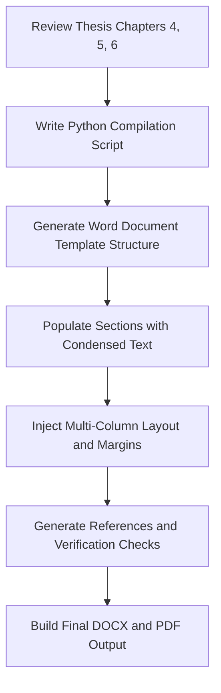

# Implementation Plan: GeoAI4SD 2026 Conference Paper Drafting

This plan outlines the systematic condensation, drafting, and formatting of the MPhil thesis findings into a high-quality, peer-reviewed conference paper for the **1st International Conference on GeoAI for Sustainable Development (GeoAI4SD 2026)**, adhering strictly to the official author guidelines.

---

## 1. Paper Structural & Formatting Rules (From Guidelines)

To ensure the paper is accepted without formatting rejects, we will programmatically and structurally enforce the following layout settings:

| Parameter | Specification | Enforcement Mechanism |
| :--- | :--- | :--- |
| **Page Size** | US Letter (8.5 × 11 inches) or A4 | Set via python-docx page properties |
| **Layout** | Strict Two-Column (3.39" width, 0.24" gap) | Section columns configuration in python-docx |
| **Margins** | Top: 1" (25mm), Left: 0.75" (19mm), Right/Bottom: Standard | Set via section page margins |
| **Font** | Times New Roman throughout | Set default style font in python-docx |
| **Text Size** | Body: 10pt (minimum 9pt allowed), Title: 14pt Bold | Configure Normal & Heading styles |
| **Alignments** | Full Justification | Set paragraph alignment property |
| **Title Page** | Center-aligned title (1.38" from top, bold, all caps) | Center paragraph, spacing-before parameter |
| **Paragraph Indent**| First paragraph of section: No indent. Following paragraphs: Indented. | Custom paragraph style definition |
| **Headings** | Numbered (e.g., **1. INTRODUCTION**), ALL CAPS, bold | Center-aligned Major Headings |
| **Subheadings** | Bold, left-aligned, Title Case (e.g., **5.1. Subheadings**) | Left-aligned, bold |
| **Sub-subheadings**| Left-aligned, italics, text begins on next line | Left-aligned, italics |
| **Page Numbers** | **DO NOT INCLUDE** | Omit header/footer page numbering fields |
| **References** | Numbered in order of appearance (e.g., `[1]`) | Format bibliography as numbered list |

---

## 2. Thesis-to-Paper Content Mapping

We will condense your ~100-page thesis into a high-density, **4-to-6 page** conference paper using the following structure:

### Title Section
* **Title**: `GEOAI-DRIVEN PRECISION AGRICULTURE PIPELINE USING A ONE-DIMENSIONAL CONVOLUTIONAL NEURAL NETWORK AND SPATIAL BLOCK CROSS-VALIDATION`
* **Authors**: [User Name], [Advisor/Co-Author Name(s)]
* **Affiliation**: Department of Geomatic Engineering, Kwame Nkrumah University of Science and Technology (KNUST), Kumasi, Ghana

### ABSTRACT & INDEX TERMS (Left Column, Page 1)
* **Length**: ~120 words (strict 100–150 word limit).
* **Content**: Summarize the precision agriculture gap in Ghana, the proposed 1D-CNN pipeline with 14-feature Sentinel-2 stacks, Spatial Block Cross-Validation (1.1 km blocks), the 98.7% test accuracy, the 370.31 km² forest/vegetation degradation mapped between 2024–2025, and the 19.5% (4.02 million kg N) nitrogen savings.
* **Index Terms**: *GeoAI, 1D-CNN, Spatial Block Cross-Validation, Variable-Rate Application, Ghana*

### 1. INTRODUCTION (Thesis Chapters 1 & 2 condensed)
* Frame the smallholder precision agriculture challenge in West Africa.
* Highlight the scientific problem of spatial data leakage in random CV (autocorrelation).
* Introduce the objectives of the study: (1) 1D-CNN model development, (2) spatial-temporal transferability, (3) variable-rate nitrogen prescription, and (4) Spatial Block CV validation.

### 2. METHODOLOGY (Thesis Chapter 3 condensed)
* **2.1. Study Area and Data Acquisition**: Prestea Huni-Valley Municipality, Sentinel-2 SR harmonized imagery, 14-dimensional feature vector (no NDVI/SAVI in classification layer).
* **2.2. VegHealthCNN Architecture**: Detail the 1D-CNN layers (Conv1D, BatchNorm, ReLU, Dropout, GAP, and Linear).
* **2.3. Spatial Block Cross-Validation**: Define the 0.01° (~1.1 km) geographic block splitting using GroupKFold.
* **2.4. Variable-Rate Nitrogen Prescription Model**: Detail the NDRE-modulated fertilizer rate allocation model.

### 3. RESULTS AND ANALYSIS (Thesis Chapter 4 condensed)
* **3.1. Model Performance**: The 98.7% overall accuracy on the 301 independent test samples, per-class metrics.
* **3.2. Spatio-Temporal Landscape Dynamics (2024–2025)**: Mapped changes showing contraction of healthy veg (-370.31 km²) and expansion of bare lands (+61.10 km²) from *galamsey*.
* **3.3. Variable-Rate Nitrogen Savings**: The 19.5% reduction in total nitrogen (saving 4,023,830 kg N across 172,334 ha).

### 4. DISCUSSION (Thesis Chapter 5 condensed)
* Compare findings to Kamilaris (2018), Roberts (2017), and Valavi (2019).
* Discuss the spatial CV pessimistic bias debate (Wadoux et al., 2021).
* Connect the temporal degradation to gold mining dynamics (Biney et al., 2022; Baddianaah et al., 2023).
* Discuss the economic and environmental significance (Ankobra River eutrophication mitigation).

### 5. CONCLUSION AND RECOMMENDATIONS (Thesis Chapter 6 condensed)
* Re-state the primary contributions.
* Synthesize the recommendations for MoFA, CSIR, and future researchers.

### 6. REFERENCES (Thesis Bibliography condensed)
* 15–20 high-impact, peer-reviewed references formatted as `[1]`, `[2]`, etc.

---

## 3. Implementation Workflow

1. **Write Python Script**: Create a compilation script `scratch/compile_conference_paper.py` that utilizes `python-docx` to construct the document programmatically.
2. **Build Document Hierarchy**: Establish the two-column section layout with a single-column title section at the top of the first page.
3. **Populate Content**: Feed the script with the exact, verified numbers from Chapters 4, 5, and 6.
4. **Formatting Check**: Use validation code to verify page margins, column configurations, font family, and justify text alignment.
5. **Compile**: Run the compilation script to generate `GEOAI4SD_2026_PRECISION_AGRI_SUBMISSION.docx`.

---

## 4. Verification Plan

### Automated Checks
* **Word Count**: Verify that the abstract is strictly between 100 and 150 words.
* **Layout Integrity**: Write a Python parser to check that margins are exactly 1" (top) and 0.75" (left), and that text is fully justified.
* **Index Terms Check**: Confirm that exactly 4 to 6 index terms are present.
* **Numerical Alignment**: Cross-reference key metrics in the generated paper (98.7% accuracy, 19.5% savings, 370.31 km² loss, 61.10 km² gain) to ensure they perfectly match the finalized values.

### Manual Verification
* Inspect the compiled Word document to ensure headers and footers do not contain page numbers, columns are balanced on the final page, and the overall spacing is visually professional.
