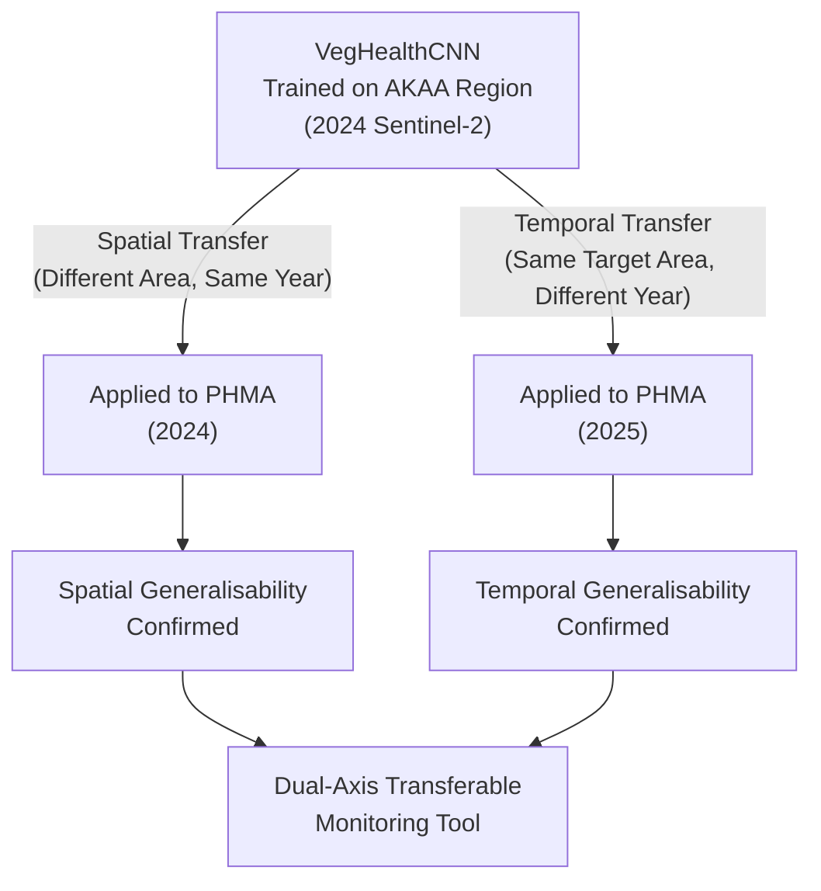

# Dual-Axis Transferability Framework: Strategy & Paper Improvements

---

## What You Actually Have (and Why It's Powerful)

You have a **dual-axis transferability test**, which is far more rigorous than what 95% of remote sensing deep learning papers report:

### Why This Matters Academically

| What most papers do | What you did |
|:---|:---|
| Train in Region A, test in Region A (random split) | Train in **AKAA**, test in **PHMA** (completely different geography) |
| Report accuracy on same-year data only | Apply to **2025 without retraining** |
| Claim "high accuracy" without spatial leakage control | Use **Spatial Block CV** to eliminate leakage within AKAA itself |
| No evidence model works outside training domain | **Two independent transfer tests** prove generalisability |

> [!IMPORTANT]
> This is not a classification study. This is a **transferability study** that happens to use classification as its evaluation metric. The core contribution is proving that a lightweight 1D-CNN, when properly validated, can be trained once and deployed across both space and time in tropical West Africa.

---

## Proposed Narrative Restructuring

### Current (V3) Framing — Weak
> "We trained and tested in PHMA using spatial blocks, then applied to 2025."

This undersells the work. It sounds like a single-site classification exercise.

### Proposed (V4) Framing — Strong
> "We trained in the AKAA region and validated spatial transferability by deploying the frozen model to the geographically separate PHMA (same year). We then validated temporal transferability by deploying the same frozen model to PHMA 2025 imagery (different year, no retraining). Both transfers produced coherent maps consistent with independently reported land-cover dynamics."

---

## Specific Section-by-Section Changes

### Title
**V3**: "...A Spatial Transferability Framework..."
**V4**: "...A Dual-Axis Spatial and Temporal Transferability Framework..."

### Abstract
Add: "trained on AKAA region imagery" and "deployed without retraining to the geographically separate PHMA for same-year spatial transfer and to 2025 composites for temporal transfer"

### Section 2.1 (Study Area)
Split into two sub-descriptions:
- **Training domain (AKAA)**: Brief description of where the model was trained
- **Transfer domain (PHMA)**: The target municipality where the model was deployed

### Section 2.3 (Spatial Block CV and Transfer Protocol)
Three-stage validation:
1. **Within-AKAA spatial blocking** → 98.7% accuracy on held-out blocks
2. **AKAA → PHMA spatial transfer** → Model applied to entirely unseen geography (2024)
3. **PHMA 2024 → PHMA 2025 temporal transfer** → Model applied to unseen time period

### Section 3.2 (Results)
Rename to: "Dual-Axis Transferability Assessment"
- **3.2a. Spatial Transfer (AKAA → PHMA, 2024)**: Report the map outputs and any quantitative evaluation
- **3.2b. Temporal Transfer (PHMA 2024 → 2025)**: Report vegetation contraction stats

### Discussion
Frame around THREE levels of validation rigour:
1. Spatial blocking within training domain (anti-leakage)
2. Cross-region spatial transfer (anti-site-specificity)
3. Cross-year temporal transfer (anti-year-specificity)

This is a **validation cascade** — each level is harder than the previous one. Very few studies in sub-Saharan African precision agriculture attempt even level 1.

---

## Questions Before I Build V4

1. **What is AKAA exactly?** Is it the Akyempim-Krobo-Attobra Area, or another administrative region? I need the correct full name and approximate coordinates for the text.

2. **Do you have quantitative accuracy metrics for the AKAA → PHMA spatial transfer?** (e.g., an independent test set in PHMA with ground truth labels?) Or was this a qualitative deployment where you visually confirmed the map makes sense?

3. **The `MODEL_TRANSFERABILITY.jpg` image** — does it show:
   - (a) Side-by-side: AKAA training region map + PHMA transfer map (2024)?
   - (b) Side-by-side: PHMA 2024 vs PHMA 2025?
   - (c) All three panels (AKAA, PHMA 2024, PHMA 2025)?

4. **The Spatial Block CV (98.7% accuracy)** — was this measured within AKAA (the training region), or within PHMA?

These answers will determine the exact narrative structure.
