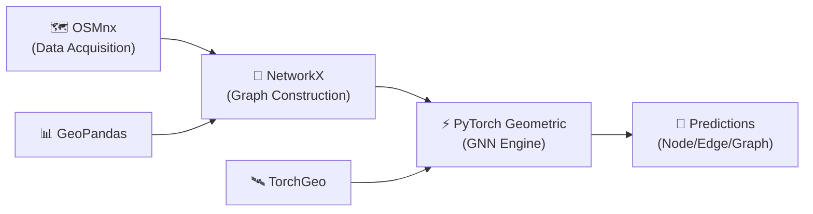
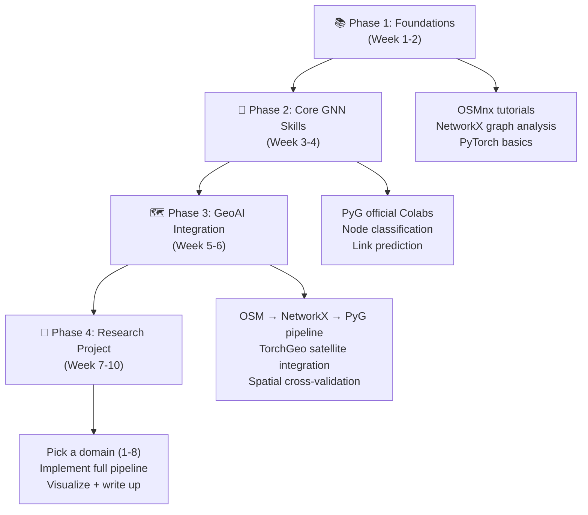

# GeoAI with OSM Data + NetworkX + PyTorch: Research & Brainstorming

> **Goal**: Map out the full landscape of GeoAI problems you can solve using **OpenStreetMap (OSM)**, **NetworkX**, and **PyTorch** — all executable on **Google Colab** or **Kaggle** with free GPU.

---

## 1. The Core Technology Stack

Before diving into problems, here's the integrated stack that makes everything work:



| Layer | Library | Role |
|:------|:--------|:-----|
| **Data Acquisition** | `osmnx`, `overpy` | Download road networks, buildings, POIs, amenities from OSM |
| **Graph Construction** | `NetworkX` | Build, clean, simplify spatial graphs (MultiDiGraph) |
| **Feature Engineering** | `NetworkX`, `scipy`, `scikit-learn` | Centrality metrics, clustering coefficients, spatial features |
| **Deep Learning on Graphs** | `PyTorch Geometric (PyG)` | GCN, GAT, GraphSAGE, spatio-temporal models |
| **Geospatial Raster DL** | `TorchGeo` (Microsoft) | Satellite imagery + OSM integration |
| **Visualization** | `folium`, `matplotlib`, `kepler.gl` | Interactive maps and static plots |

> [!IMPORTANT]
> The key conversion step is **NetworkX → PyTorch Geometric**. PyG provides `from_networkx()` to convert any NetworkX graph into a `Data` object ready for GNN training.

```python
# The critical bridge code
from torch_geometric.utils import from_networkx
import osmnx as ox

G = ox.graph_from_place("Accra, Ghana", network_type="drive")
# Add node/edge features, then:
data = from_networkx(G)  # → PyG Data object
```

---

## 2. The Eight Problem Domains

### 🚦 Domain 1: Traffic Flow & Travel Time Prediction (STGCN)

**The Problem**: Given a road network and historical/simulated traffic data, predict future traffic speed, flow, or travel time on each road segment.

**Why OSM + PyTorch?**
- OSM provides the **graph topology** (intersections = nodes, roads = edges)
- Spatio-Temporal Graph Convolutional Networks (STGCNs) in PyTorch capture both spatial dependencies (nearby roads affect each other) and temporal patterns (rush hour, weekday vs. weekend)

**Technical Pipeline**:
1. `osmnx` → Download road network for a city (e.g., Accra, Kumasi)
2. `NetworkX` → Compute adjacency matrix, add edge attributes (road length, type, speed limit)
3. Overlay real or simulated traffic sensor data onto graph nodes/edges
4. Train an **STGCN** or **DCRNN** model using PyTorch Geometric Temporal
5. Predict traffic conditions 15/30/60 minutes ahead

**Key Libraries**: `torch-geometric-temporal`, `osmnx`, `networkx`

**Benchmark Datasets**: PeMSD7, METR-LA (can supplement with OSM topology)

**Colab Feasibility**: ✅ Excellent — benchmark datasets are small, models train in minutes on T4 GPU

**Difficulty**: ⭐⭐⭐ (Intermediate — the hardest part is the temporal data pipeline)

**Concrete Project Idea**: *"Predicting traffic congestion propagation in Accra's road network using STGCN"*

---

### 🏗️ Domain 2: Building Type & Land Use Classification (GNN)

**The Problem**: Predict missing building types (residential, commercial, industrial) or land use categories from OSM's spatial context — without satellite imagery.

**Why OSM + PyTorch?**
- OSM has **millions of buildings with missing `building:type` tags**, especially in the Global South
- GNNs learn from the *spatial neighborhood*: a building near a school, on a residential street, surrounded by houses → likely residential
- This is a **node classification** problem on a heterogeneous urban graph

**Technical Pipeline**:
1. `osmnx` → Download buildings, roads, amenities, land use polygons for a region
2. Construct a **heterogeneous graph**: buildings as nodes, edges = spatial proximity / road connectivity / shared land parcel
3. Node features: building area, perimeter, number of floors, nearest road type, POI density
4. Train a **GAT** or **Graph Transformer** for multi-class classification
5. Predict: residential / commercial / industrial / institutional / mixed-use

**Key Architecture**: Graph Attention Network (GAT) — dynamically weights the influence of neighboring buildings

**Colab Feasibility**: ✅ Excellent — graph sizes for a city district are manageable (~10K–100K nodes)

**Difficulty**: ⭐⭐⭐ (Intermediate)

**Concrete Project Idea**: *"Predicting building function in Kumasi using Graph Attention Networks on OSM data"*

---

### 🔗 Domain 3: Link Prediction — Missing Road Detection

**The Problem**: Detect missing road segments in OpenStreetMap, particularly in under-mapped regions of Africa, Asia, and Latin America.

**Why OSM + PyTorch?**
- OSM completeness varies drastically — urban Ghana may be 80%+ mapped, but rural areas can be <40%
- **Link prediction** on the road graph asks: "Should there be an edge (road) between these two nodes (intersections)?"
- GNNs learn structural patterns (dead-ends that should connect, grid patterns with gaps)

**Technical Pipeline**:
1. `osmnx` → Download road network for a well-mapped city (ground truth)
2. Randomly remove 10–20% of edges → create training/test splits
3. Node features: degree, betweenness centrality, GPS coordinates, clustering coefficient
4. Train a **link prediction model** (GCN encoder + dot-product decoder)
5. Apply to under-mapped regions to flag likely missing roads

**Key Architecture**: 
- **VGAE** (Variational Graph Auto-Encoder) — learns latent representations, reconstructs adjacency
- **SEAL** (Subgraph Extraction and Link prediction) — extracts local subgraphs around candidate links

**Colab Feasibility**: ✅ Excellent — this is a classic PyG problem with built-in utilities

**Difficulty**: ⭐⭐ (Beginner-Intermediate — PyG has excellent link prediction tutorials)

**Concrete Project Idea**: *"Detecting unmapped roads in rural Ghana using Variational Graph Autoencoders on OSM data"*

> [!TIP]
> This is arguably the **most publishable** idea for a GeoAI context in the Global South. OSM completeness is a well-known challenge, and automated detection of missing infrastructure directly supports humanitarian mapping (HOT, MapSwipe).

---

### 🏥 Domain 4: Facility Location & Accessibility Analysis

**The Problem**: Optimize placement of new facilities (hospitals, schools, fire stations) to maximize population coverage, or assess equity of existing service distribution.

**Why OSM + PyTorch?**
- OSM provides the **road network** (for real travel-time computation) and **existing facility locations**
- NetworkX computes shortest paths, isochrones
- PyTorch can learn **optimal placement policies** via reinforcement learning or regression

**Technical Pipeline**:
1. `osmnx` → Road network + existing facilities (`amenity=hospital`, `amenity=school`)
2. `NetworkX` → Compute travel time matrices between candidate sites and population centers
3. Integrate WorldPop population raster data
4. **Option A**: Classical optimization with `PuLP`/`Pyomo` (p-median, MCLP models)
5. **Option B**: Train a GNN to predict "coverage score" for candidate locations → faster than exact optimization

**Hybrid Approach (Classical + DL)**:
- Use GNN as a **fast surrogate** for expensive optimization — train on solved instances, predict solutions for new configurations

**Colab Feasibility**: ✅ Good — computational bottleneck is in routing, not GPU

**Difficulty**: ⭐⭐⭐⭐ (Advanced — requires integrating multiple data sources)

**Concrete Project Idea**: *"GNN-assisted optimal health facility placement in Ghana's Northern Region"*

---

### 🌊 Domain 5: Disaster Response & Emergency Routing

**The Problem**: During floods, earthquakes, or conflicts, which roads become impassable? How should emergency routing adapt in real-time?

**Why OSM + PyTorch?**
- OSM road network = the baseline infrastructure graph
- GNNs can model **cascading failures** — one road closure redirects traffic, overloading neighboring roads
- Predict network-wide impact of localized disruptions

**Technical Pipeline**:
1. `osmnx` → Full road network with elevation data
2. Overlay flood hazard maps (HAND model, satellite-derived flood extent)
3. Mark affected edges (flooded roads) → partial graph
4. GNN predicts: which remaining routes are viable? Which areas become isolated?
5. Dynamic re-routing using modified Dijkstra on the predicted "surviving" graph

**Key Architectures**:
- **GraphSAGE** — inductive learning, generalizes to unseen graph topologies
- **Temporal GNN** — models the *progression* of a flood/disaster over time

**Colab Feasibility**: ✅ Good — synthetic disaster scenarios can be generated programmatically

**Difficulty**: ⭐⭐⭐⭐ (Advanced)

**Concrete Project Idea**: *"Predicting road network isolation during flood events in the Volta Region using GNNs"*

---

### 📍 Domain 6: POI Embedding & Urban Function Discovery

**The Problem**: Learn vector representations of places (neighborhoods, districts) from OSM POIs to enable downstream tasks like similarity search, clustering, and socioeconomic prediction.

**Why OSM + PyTorch?**
- OSM POIs (restaurants, shops, schools, churches) encode the **functional character** of a neighborhood
- Representation learning creates embeddings where similar neighborhoods are close in vector space
- These embeddings become features for regression (predict property values, population density, crime rates)

**Technical Pipeline**:
1. `osmnx.features_from_place()` → Extract all POIs with category tags
2. Partition city into **hexagonal grid** (Uber H3) or administrative zones
3. For each zone: count POI types, compute diversity indices, road density
4. Build a **zone adjacency graph** (zones sharing borders = connected)
5. Train **Node2Vec** or **GCN** to learn zone embeddings
6. Downstream: cluster zones, predict socioeconomic indicators

**Key Approaches**:
- **Place2Vec** — adapted Word2Vec for geographic contexts
- **GAT on zone graph** — attention-weighted neighborhood aggregation
- **Multi-modal fusion** — combine POI embeddings with satellite imagery features (via TorchGeo)

**Colab Feasibility**: ✅ Excellent — lightweight computation, small graphs

**Difficulty**: ⭐⭐ (Beginner-Intermediate)

**Concrete Project Idea**: *"Learning neighborhood representations from OSM POIs in Accra for urban functional analysis"*

---

### 🛣️ Domain 7: Road Network Resilience & Vulnerability

**The Problem**: Which road segments, if removed, would cause the most disruption to the overall network? Rank roads by criticality.

**Why OSM + PyTorch?**
- Traditional methods (betweenness centrality, percolation analysis) are **computationally expensive** for large networks
- GNNs act as **fast surrogates** — trained on simulated disruptions, they predict network-wide impact in milliseconds

**Technical Pipeline**:
1. `osmnx` → Road network graph
2. Simulate edge removals → measure impact (increase in average travel time, number of disconnected components)
3. Generate training data: (graph state, removed edge) → impact score
4. Train a GNN to predict impact scores for any edge
5. Rank all edges by predicted criticality → vulnerability map

**Key Architecture**: **GCN with edge-level regression** — predicts a continuous "criticality score" per edge

**Colab Feasibility**: ✅ Good — simulation is the bottleneck, but parallelizable

**Difficulty**: ⭐⭐⭐ (Intermediate)

**Concrete Project Idea**: *"GNN-based rapid vulnerability assessment of Ghana's trunk road network"*

---

### 🗺️ Domain 8: OSM Data Quality & Completeness Assessment

**The Problem**: Automatically assess the quality and completeness of OSM data in a given region. Recommend missing tags, flag inconsistencies, predict unmapped areas.

**Why OSM + PyTorch?**
- This is a **meta-problem** about OSM itself
- GNNs can propagate "quality signals" from well-mapped areas to nearby poorly-mapped areas
- CNNs on satellite imagery can detect features (buildings, roads) missing from OSM

**Technical Pipeline**:
1. `osmnx` → Extract all features for a region
2. Compute intrinsic quality metrics: tag completeness, feature density, contributor diversity
3. Build a spatial graph (regions as nodes, adjacency as edges)
4. Train a GNN to predict completeness score for under-surveyed regions
5. **Bonus**: Combine with TorchGeo satellite imagery to detect unmapped buildings

**Key Architecture**: 
- **Graph-level regression** — predict a quality score per spatial region
- **Multi-modal GNN** — fuse OSM graph features with satellite imagery embeddings

**Colab Feasibility**: ✅ Excellent

**Difficulty**: ⭐⭐⭐ (Intermediate)

**Concrete Project Idea**: *"Predicting OSM mapping completeness in West Africa using multi-modal Graph Neural Networks"*

---

## 3. Summary Matrix: All Problems at a Glance

| # | Problem Domain | GNN Task Type | Key Architecture | Difficulty | Publishability | Ghana Relevance |
|:-:|:---------------|:-------------|:----------------|:----------:|:-------------:|:---------------:|
| 1 | Traffic Prediction | Edge Regression (Temporal) | STGCN, DCRNN | ⭐⭐⭐ | ⭐⭐⭐ | 🟡 Medium |
| 2 | Building Classification | Node Classification | GAT, GraphTransformer | ⭐⭐⭐ | ⭐⭐⭐⭐ | 🟢 High |
| 3 | Missing Road Detection | Link Prediction | VGAE, SEAL | ⭐⭐ | ⭐⭐⭐⭐⭐ | 🟢 High |
| 4 | Facility Location | Node Regression + Optimization | GCN + RL/Optimization | ⭐⭐⭐⭐ | ⭐⭐⭐⭐ | 🟢 High |
| 5 | Disaster Routing | Edge Classification (Temporal) | GraphSAGE, T-GNN | ⭐⭐⭐⭐ | ⭐⭐⭐⭐ | 🟢 High |
| 6 | POI Embeddings | Node Embedding | Node2Vec, GAT | ⭐⭐ | ⭐⭐⭐ | 🟡 Medium |
| 7 | Network Resilience | Edge Regression | GCN | ⭐⭐⭐ | ⭐⭐⭐⭐ | 🟢 High |
| 8 | OSM Quality Assessment | Graph Regression | Multi-modal GNN | ⭐⭐⭐ | ⭐⭐⭐⭐⭐ | 🟢 High |

---

## 4. Colab/Kaggle Setup: What You Need

### Installation Cell (Copy-Paste Ready)

```python
# Core GeoAI Stack
!pip install osmnx networkx geopandas shapely folium

# PyTorch Geometric (check CUDA version first)
!pip install torch-geometric
!pip install pyg-lib torch-scatter torch-sparse torch-cluster torch-spline-conv -f https://data.pyg.org/whl/torch-2.1.0+cu121.html

# Spatio-Temporal Extension
!pip install torch-geometric-temporal

# Microsoft TorchGeo (for satellite imagery integration)
!pip install torchgeo

# Visualization
!pip install keplergl contextily
```

### Free GPU Resources

| Platform | GPU | VRAM | Session Limit | Best For |
|:---------|:----|:-----|:-------------|:---------|
| **Colab Free** | T4 | 15 GB | ~12 hours | Prototyping, small graphs |
| **Colab Pro** | A100 | 40 GB | ~24 hours | Large city-scale graphs |
| **Kaggle** | P100/T4 | 16 GB | 30 hrs/week | Competitions, persistent datasets |

> [!NOTE]
> All 8 problem domains above are feasible on **free-tier Colab** for city-district-scale analysis. For full-city or country-scale, you may need Colab Pro or batch processing.

---

## 5. Recommended Starter Project

> [!IMPORTANT]
> **If you want to start immediately, I recommend Domain 3: Missing Road Detection (Link Prediction).** Here's why:

### Why Link Prediction is the Best Starting Point

1. **Technically clean**: Link prediction is a well-defined, well-supported task in PyTorch Geometric
2. **Data is free**: OSM IS the dataset — no external data needed
3. **Africa-relevant**: Under-mapping in rural Ghana is a real, documented problem
4. **Publishable**: Connects to humanitarian mapping (HOT, Missing Maps) — high impact
5. **Scalable**: Start with one district, extend to the whole country
6. **Foundation**: The skills transfer directly to Domains 2, 6, 7, and 8

### Minimal Working Pipeline (Colab)

```python
import osmnx as ox
import networkx as nx
import torch
from torch_geometric.utils import from_networkx
from torch_geometric.transforms import RandomLinkSplit
from torch_geometric.nn import GCNConv

# 1. Get road network
G = ox.graph_from_place("Accra, Ghana", network_type="drive")
G = ox.routing.add_edge_speeds(G)

# 2. Add node features  
for node in G.nodes():
    G.nodes[node]['x'] = [
        float(G.degree(node)),
        float(nx.betweenness_centrality(G).get(node, 0)),
        float(G.nodes[node].get('y', 0)),  # latitude
        float(G.nodes[node].get('x', 0)),  # longitude
    ]

# 3. Convert to PyG
data = from_networkx(G)

# 4. Split edges for link prediction
transform = RandomLinkSplit(num_val=0.1, num_test=0.2, 
                            is_undirected=True, 
                            add_negative_train_samples=True)
train_data, val_data, test_data = transform(data)

# 5. Define simple GCN encoder
class GCNEncoder(torch.nn.Module):
    def __init__(self, in_channels, out_channels):
        super().__init__()
        self.conv1 = GCNConv(in_channels, 64)
        self.conv2 = GCNConv(64, out_channels)
    
    def forward(self, x, edge_index):
        x = self.conv1(x, edge_index).relu()
        return self.conv2(x, edge_index)

# 6. Train → Predict → Visualize on map
```

---

## 6. Learning Path: From Zero to GeoAI



### Key Learning Resources

| Resource | Platform | Topics |
|:---------|:---------|:-------|
| [OSMnx Examples](https://github.com/gboeing/osmnx-examples) | GitHub | Network download, analysis, visualization |
| [PyG Official Colabs](https://pytorch-geometric.readthedocs.io/en/latest/notes/colabs.html) | Colab | GCN, GAT, Link Prediction, Graph Classification |
| [Stanford CS224W](https://web.stanford.edu/class/cs224w/) | YouTube/Colab | Full GNN course with hands-on notebooks |
| [TorchGeo Tutorials](https://torchgeo.readthedocs.io/) | GitHub/Colab | Geospatial deep learning with satellite data |
| PyG Temporal Docs | GitHub | Spatio-temporal GNNs for traffic |

---

## 7. Open Questions for Discussion

> [!IMPORTANT]
> To help me narrow down the best project for you, consider:

1. **Which domain excites you most?** (Traffic? Building classification? Missing roads? Disaster response?)
2. **What is the end goal?** 
   - A Kaggle notebook / portfolio piece?
   - A publishable research paper?
   - A practical tool for a specific use case?
3. **Geographic focus**: Ghana specifically? Or global/transferable?
4. **Timeline**: How many weeks/months do you want to invest?
5. **Prior experience**: How comfortable are you with PyTorch already? Have you used PyTorch Geometric before?
6. **Data availability**: Do you have access to any local traffic, census, or hazard data that could enrich the OSM base?

---

## 8. What's Next?

Once you pick a direction, I can:
- 🔨 **Build a complete, runnable Colab notebook** for your chosen problem
- 📄 **Draft a research framing** (problem statement, related work, methodology)
- 📊 **Create the data pipeline** (OSM download → graph → PyG → training → visualization)
- 🗺️ **Generate interactive maps** of results using Folium/KeplerGL
