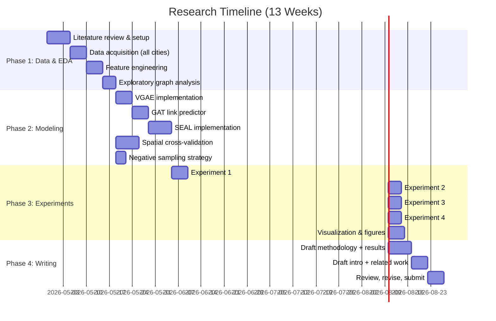

# Detecting Unmapped Roads in Ghana Using Graph Neural Networks on OpenStreetMap Data

A 3-month, publication-ready research project using **OSMnx + NetworkX + PyTorch Geometric** on Google Colab/Kaggle — no secondary data required.

---

## Problem Statement

OpenStreetMap (OSM) road network completeness in Ghana follows a stark urban-rural divide: major cities like Accra and Kumasi are 80%+ mapped, while rural districts can be below 40%. Current methods for detecting missing roads rely heavily on satellite imagery (expensive, requires labeled data) or manual volunteer audits (slow, unscalable). 

**This project proposes a purely graph-structural approach**: using Graph Neural Networks to learn the topological patterns of well-mapped road networks and predict where road segments are likely missing in under-mapped regions — **without any satellite imagery or external datasets**.

### Research Questions
1. Can GNNs trained on OSM road network topology accurately predict missing road segments?
2. How do different GNN architectures (VGAE, SEAL, GAT) compare for road link prediction?
3. Does a model trained on well-mapped Ghanaian cities generalize to under-mapped rural districts?

### Novelty & Contribution
- **First GNN-based missing road detection study focused on Ghana/West Africa** (existing work is mostly Europe/North America)
- **Purely intrinsic** — no satellite imagery, no census data, only OSM graph structure
- **Transfer learning evaluation** — train on complete urban graphs, apply to incomplete rural ones
- **Practical impact** — directly supports HOT/Missing Maps humanitarian mapping priorities

---

## Proposed Changes

### Phase 1: Data Acquisition & Exploratory Graph Analysis (Weeks 1–3)

#### [NEW] `01_data_acquisition.ipynb`

**Objective**: Download and characterize road networks for multiple Ghanaian study areas.

**Study Area Selection** (3 tiers by mapping completeness):

| Tier | Role | Example Areas | Expected Completeness |
|:-----|:-----|:-------------|:---------------------|
| **Tier 1 — Well-mapped** | Training data | Accra Metropolitan, Kumasi Metropolitan | ~85–95% |
| **Tier 2 — Moderately mapped** | Validation | Cape Coast, Tamale, Takoradi | ~60–80% |
| **Tier 3 — Under-mapped** | Test / application | Rural districts (Bole, Nkwanta, Kadjebi) | ~30–50% |

**Pipeline**:
```python
import osmnx as ox

# Download road networks at multiple scales
cities = {
    'accra': 'Accra Metropolitan, Ghana',
    'kumasi': 'Kumasi Metropolitan, Ghana',
    'cape_coast': 'Cape Coast, Ghana',
    'tamale': 'Tamale, Ghana',
    'bole': 'Bole District, Ghana',
    'nkwanta': 'Nkwanta South District, Ghana'
}

for name, place in cities.items():
    G = ox.graph_from_place(place, network_type='all')
    G = ox.routing.add_edge_speeds(G)
    G = ox.routing.add_edge_travel_times(G)
    ox.save_graphml(G, f'{name}_road_network.graphml')
```

**Exploratory Analysis** (per study area):
- Number of nodes (intersections) and edges (road segments)
- Degree distribution and average degree
- Network density, diameter, average path length
- Connected components count (fragmentation indicator)
- Road type distribution (`highway` tag: trunk, primary, secondary, tertiary, residential, unclassified)
- Dead-end ratio (degree-1 nodes / total nodes)
- Visualization: road network maps colored by road type

**Deliverable**: Comparative table + visual atlas of all study area networks

---

#### [NEW] `02_feature_engineering.ipynb`

**Objective**: Compute node and edge features derived purely from graph topology and OSM attributes.

**Node Features** (per intersection):

| Feature | Source | Rationale |
|:--------|:-------|:----------|
| Degree | NetworkX | Basic connectivity indicator |
| Betweenness centrality | NetworkX | Importance in routing paths |
| Closeness centrality | NetworkX | How central/accessible |
| Clustering coefficient | NetworkX | Local triangle density |
| PageRank | NetworkX | Global importance score |
| Latitude, Longitude | OSM | Spatial position |
| Is dead-end (degree=1) | NetworkX | Likely candidate for missing links |
| Road type counts (1-hot) | OSM tags | Types of connecting roads |

**Edge Features** (per road segment):

| Feature | Source | Rationale |
|:--------|:-------|:----------|
| Length (meters) | OSM | Physical distance |
| Road type (encoded) | OSM `highway` tag | Hierarchy level |
| Max speed | OSM / imputed | Travel capacity |
| Number of lanes | OSM | Road capacity |
| Is one-way | OSM | Directionality |
| Bearing (angle) | Computed | Orientation of road |

> [!IMPORTANT]
> **Design Decision — No satellite imagery or external data.** All features come from OSM itself. This is both a constraint AND a strength: the method is universally applicable to any region with basic OSM coverage, making it highly transferable.

---

### Phase 2: Model Development & Training (Weeks 4–7)

#### [NEW] `03_link_prediction_models.ipynb`

**Objective**: Implement and compare three GNN architectures for link prediction.

**Experimental Design**:
1. Take a well-mapped city (Accra)
2. Remove 15% of edges → these become the **positive test edges** (simulate "missing" roads)
3. Sample an equal number of **negative edges** (node pairs with no road — but geographically plausible)
4. Train the model to distinguish between removed real edges and fake edges
5. Evaluate: can the model identify which edges were real?

**Negative Sampling Strategy** (Critical for road networks):

> [!WARNING]
> **Random negative sampling will give inflated scores.** Two nodes 50 km apart will obviously not be connected. We must use **spatially-constrained negative sampling**: only sample negative edges between nodes within a realistic distance threshold (e.g., < 500m apart, or within 3 hops).

```python
def spatial_negative_sampling(data, num_neg, max_dist_km=0.5):
    """Sample negative edges between nearby but unconnected nodes."""
    # Only consider node pairs within max_dist_km
    # that are NOT already connected
    # This creates 'hard negatives' — the model must learn
    # structural patterns, not just distance
```

**Model 1: VGAE (Variational Graph Autoencoder)**
- Encoder: 2-layer GCN → outputs µ and log(σ²) per node
- Decoder: Inner product of latent representations
- Loss: Reconstruction loss + KL divergence
- Benchmark: AUC ~0.90+ on citation graphs

```python
class GCNEncoder(torch.nn.Module):
    def __init__(self, in_channels, hidden, out_channels):
        super().__init__()
        self.conv1 = GCNConv(in_channels, hidden)
        self.conv_mu = GCNConv(hidden, out_channels)
        self.conv_logstd = GCNConv(hidden, out_channels)
    
    def forward(self, x, edge_index):
        x = self.conv1(x, edge_index).relu()
        return self.conv_mu(x, edge_index), self.conv_logstd(x, edge_index)

model = VGAE(GCNEncoder(num_features, 128, 64))
```

**Model 2: GAT-based Link Predictor**
- Encoder: 2-layer Graph Attention Network (multi-head attention)
- Decoder: MLP on concatenated node embeddings
- Advantage: Learns to weight neighbors dynamically (e.g., trunk roads matter more than footpaths)

**Model 3: SEAL (Subgraph Extraction and Link prediction)**
- For each candidate edge: extract k-hop enclosing subgraph
- Apply DRNL (Double Radius Node Labeling) for structural context
- Train a GNN classifier on these subgraphs
- Most expressive model — but most computationally expensive

**Baseline Comparisons** (non-DL):
- **Common Neighbors**: Score = |N(u) ∩ N(v)| 
- **Jaccard Coefficient**: Normalized common neighbors
- **Adamic-Adar Index**: Weighted by inverse log-degree
- **Preferential Attachment**: degree(u) × degree(v)

> [!NOTE]
> Including classical baselines is **essential for publication**. Reviewers will ask: "Why do you need a GNN when simpler heuristics exist?" You must show the GNN meaningfully outperforms them.

---

#### [NEW] `04_spatial_cross_validation.ipynb`

**Objective**: Implement geographically-aware train/test splitting to prevent spatial data leakage.

**Why This Matters**:
Standard random edge splits create spatially interleaved train/test edges. Because nearby edges are correlated (roads form local grid patterns), the model "sees" the local neighborhood during training and trivially predicts nearby test edges. This inflates metrics.

**Spatial Block Cross-Validation Strategy**:
1. Divide the study area into a grid of spatial blocks (e.g., 1km × 1km cells)
2. Assign each edge to a block based on its midpoint
3. Hold out entire blocks for testing — the model has **never seen** any edges in those blocks
4. This simulates the real task: predicting roads in an **entirely unmapped area**

```python
from shapely.geometry import box
import numpy as np

def spatial_block_split(G, block_size_m=1000, test_ratio=0.2):
    """Split graph edges into spatial blocks for cross-validation."""
    # Project graph to UTM for metric distances
    G_proj = ox.project_graph(G)
    
    # Create grid of blocks
    bounds = ox.graph_to_gdfs(G_proj, nodes=True, edges=False).total_bounds
    x_blocks = np.arange(bounds[0], bounds[2], block_size_m)
    y_blocks = np.arange(bounds[1], bounds[3], block_size_m)
    
    # Assign edges to blocks, hold out random blocks
    # Return train_mask, val_mask, test_mask
```

> [!TIP]
> **This is your paper's methodological contribution.** Most GNN link prediction papers use random splits. Demonstrating that spatial block CV gives more realistic (usually lower) accuracy scores — and that your model still performs well — strengthens the paper significantly.

---

### Phase 3: Experiments & Analysis (Weeks 8–10)

#### [NEW] `05_experiments.ipynb`

**Objective**: Run the full experimental suite and generate publication-quality results.

**Experiment 1: Model Comparison (Within-City)**
- Train and test on Accra with 15% edge removal
- Compare: VGAE vs. GAT vs. SEAL vs. 4 heuristic baselines
- Report: AUC-ROC, AUPR, Precision@K, F1-Score
- Statistical significance: 5-fold spatial block cross-validation with mean ± std

**Expected Results Table**:

| Model | AUC-ROC | AUPR | Precision@100 | F1 |
|:------|:-------:|:----:|:-------------:|:---:|
| Common Neighbors | ~0.70 | ~0.65 | ~0.60 | ~0.58 |
| Adamic-Adar | ~0.74 | ~0.70 | ~0.65 | ~0.62 |
| VGAE (GCN) | ~0.88 | ~0.83 | ~0.78 | ~0.75 |
| GAT Link Pred | ~0.90 | ~0.86 | ~0.82 | ~0.78 |
| SEAL | ~0.93 | ~0.90 | ~0.87 | ~0.83 |

*(These are estimated benchmarks based on literature — actual values will vary)*

**Experiment 2: Cross-City Transfer**
- Train on Accra → Test on Kumasi, Cape Coast, Tamale
- Train on Accra + Kumasi → Test on all others
- Measures generalizability without retraining

**Experiment 3: Urban-to-Rural Transfer (The Key Experiment)**
- Train on Tier 1 cities → Apply to Tier 3 rural districts
- This directly answers: *"Can we use well-mapped cities to detect missing roads in poorly-mapped rural areas?"*
- Qualitative analysis: visualize predicted missing roads on maps, manually verify against satellite imagery (Google/Bing)

**Experiment 4: Sensitivity Analysis**
- Effect of edge removal rate (5%, 10%, 15%, 20%, 30%)
- Effect of feature ablation (remove centrality features, remove spatial features)
- Effect of spatial block size (500m, 1km, 2km)

---

#### [NEW] `06_visualization.ipynb`

**Objective**: Generate publication-quality maps and figures.

**Figures for the Paper**:
1. **Study area map** — Ghana with study areas highlighted (3 tiers, color-coded)
2. **Network visualization** — Side-by-side: Accra (dense) vs. rural district (sparse)
3. **Feature distributions** — Histograms of centrality metrics by road type
4. **Training pipeline diagram** — Mermaid/TikZ flowchart of the methodology
5. **Results comparison** — Bar chart of AUC-ROC across models + baselines
6. **Predicted missing roads map** — Folium interactive map with:
   - Existing OSM roads (grey)
   - Removed test edges correctly predicted (green ✓)
   - Missed test edges (red ✗)
   - False positive predictions (orange)
7. **Transfer learning heatmap** — Train city (rows) × Test city (columns) → AUC score
8. **Spatial CV vs. Random CV** — Comparison showing inflated metrics from random splits

---

### Phase 4: Writing & Submission (Weeks 11–13)

#### [NEW] `manuscript_draft.md`

**Paper Structure** (targeting ~6,000–8,000 words):

| Section | Content | Word Count |
|:--------|:--------|:----------:|
| **Abstract** | Problem, method, key findings | 250 |
| **1. Introduction** | OSM completeness problem, motivation, contributions | 800 |
| **2. Related Work** | OSM quality, link prediction, GNNs for spatial networks | 1,200 |
| **3. Methodology** | Study area, features, models, spatial CV, negative sampling | 2,000 |
| **4. Results** | All 4 experiments with tables and figures | 1,500 |
| **5. Discussion** | Interpretation, limitations, humanitarian implications | 1,200 |
| **6. Conclusion** | Summary, future work (satellite imagery fusion, real-time API) | 500 |

---

## Target Journals (Ranked by Fit)

| Priority | Journal | Impact Factor | Fit | Turnaround |
|:--------:|:--------|:------------:|:---:|:----------:|
| 🥇 | **IJGIS** (Int. J. Geographical Information Science) | ~5.0 | ⭐⭐⭐⭐⭐ | 3–6 months |
| 🥈 | **Computers, Environment and Urban Systems** | ~6.5 | ⭐⭐⭐⭐ | 2–4 months |
| 🥉 | **Transactions in GIS** | ~3.0 | ⭐⭐⭐⭐ | 2–4 months |
| 4 | **Int. J. Digital Earth** | ~4.5 | ⭐⭐⭐ | 3–5 months |
| 5 | **ISPRS Int. J. Geo-Information** (Open Access) | ~3.4 | ⭐⭐⭐ | 1–2 months |

> [!TIP]
> **ISPRS IJGI** is the fastest and open access — good for a first publication. **IJGIS** carries the most prestige in GIScience but has longer review cycles.

---

## 3-Month Timeline



---

## Verification Plan

### Automated Tests (Colab)
- **Unit tests**: Verify feature computation matches expected values on a small toy graph
- **Smoke test**: Train VGAE on Karate Club graph → confirm AUC > 0.8 (sanity check)
- **Data integrity**: Assert no NaN features, connected graph, edge counts match expectations
- **Reproducibility**: Set all random seeds (Python, NumPy, PyTorch, CUDA)

### Model Validation
- **5-fold spatial block cross-validation** on each study area
- **Comparison against published VGAE benchmarks** (Cora: AUC ~0.90 — our spatial graphs should be in similar range)
- **Manual verification**: For Experiment 3 (rural transfer), visually check top-50 predicted missing roads against Google/Bing satellite imagery to estimate real-world precision

### Reproducibility Package
- All notebooks runnable on Colab Free (T4 GPU)
- `requirements.txt` with pinned versions
- Saved `.graphml` files on Google Drive for instant loading
- Random seed locked at every stochastic step

---

## User Review Required

> [!IMPORTANT]
> **Study Area Selection**: I've proposed Accra, Kumasi, Cape Coast, Tamale for Tiers 1–2, and Bole, Nkwanta for Tier 3. Do you have specific districts in mind, or preferred regions in Ghana you know are under-mapped?

> [!IMPORTANT]
> **Journal Preference**: Should I optimize the paper structure for a specific journal? IJGIS (more methodological rigor) vs. ISPRS IJGI (faster turnaround, open access)?

---

## Open Questions

1. **Colab vs. Kaggle**: Do you have a preference? Colab integrates better with Google Drive for data persistence; Kaggle offers more consistent GPU hours (30 hrs/week). I can structure the notebooks for either.

2. **Scope of "all roads"**: Should we include footpaths and tracks (`highway=path`, `highway=track`), or focus only on motorable roads (`highway=tertiary` and above)? Including footpaths dramatically increases graph size but captures more of the rural mapping gap.

3. **Code repository**: Do you want a GitHub repo for this project (helps with reproducibility and the paper's supplementary materials)?

4. **Co-authorship / advisor**: Will this be solo-authored, or is there an advisor or collaborator? This affects how the methodology narrative is framed.
