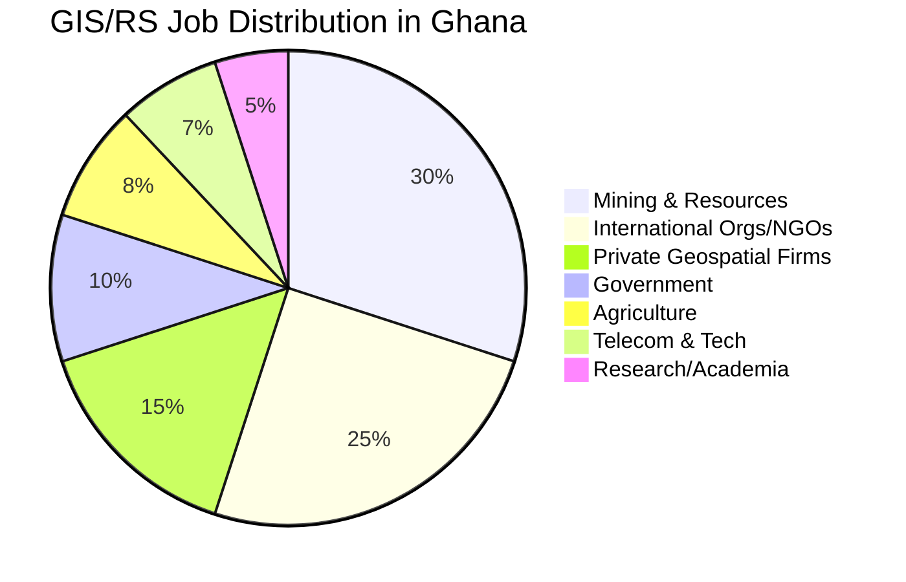

# 🇬🇭 GIS, Remote Sensing & Geography — Jobs & Internships in Ghana

> **Last Updated:** April 30, 2026  
> **Scope:** Full-time jobs, contract positions, consultancies, and internships  
> **Focus Areas:** GIS, Remote Sensing, Geospatial Analysis, Surveying, Mapping, Data Analytics

---

## Table of Contents
1. [🏢 Sectors Actively Hiring](#-sectors-actively-hiring)
2. [⛏️ Mining Sector](#️-mining-sector)
3. [🌍 International Organizations & NGOs](#-international-organizations--ngos)
4. [🏛️ Government & Public Sector](#️-government--public-sector)
5. [💼 Private Sector / Geospatial Companies](#-private-sector--geospatial-companies)
6. [🔬 Research Institutions & Academia](#-research-institutions--academia)
7. [🌱 Agriculture & Environment](#-agriculture--environment)
8. [📱 Tech & Telecommunications](#-tech--telecommunications)
9. [🎓 Internship Opportunities](#-internship-opportunities)
10. [🖥️ Remote / Freelance Opportunities](#️-remote--freelance-opportunities)
11. [🔍 Job Search Platforms & Direct Links](#-job-search-platforms--direct-links)
12. [📋 Action Plan](#-action-plan)

---

## 🏢 Sectors Actively Hiring

The GIS/RS job market in Ghana spans multiple sectors. Here's where the demand is strongest:



---

## ⛏️ Mining Sector

> [!IMPORTANT]
> Mining is the **largest employer** of GIS professionals in Ghana. These roles offer some of the highest salaries in the geospatial field locally.

### Key Employers & Roles

| Company | Typical GIS Roles | Location | Career Portal |
|---|---|---|---|
| **AngloGold Ashanti** | GIS Specialist, Land Access Officer, Mine Surveyor | Obuasi, Accra | [anglogoldashanti.com/careers](https://www.anglogoldashanti.com/careers/) |
| **Newmont Ghana (Ahafo/Akyem)** | GIS Analyst, Surveyor, Environmental Data Specialist | Ahafo, Birim North | [newmont.com/careers](https://www.newmont.com/careers/) |
| **Gold Fields (Tarkwa/Damang)** | Mine Surveyor, GIS Technician | Tarkwa | [goldfields.com/careers](https://www.goldfields.com/careers/) |
| **Perseus Mining** | GIS Officer, Land & Community Relations | Ayanfuri | [perseusmining.com](https://perseusmining.com/) |
| **Kinross (Chirano)** | Spatial Data Analyst, Survey Technician | Bibiani | [kinross.com/careers](https://www.kinross.com/careers/) |
| **Galiano Gold (Asanko)** | GIS/Survey Tech, Environmental Monitoring | Nkran | [galianogold.com](https://www.galianogold.com/) |

### Skills Required
- ArcGIS Pro, QGIS, Surpac, Deswik
- GPS/GNSS surveys, drone mapping
- Volumetric calculations, pit surveys
- Knowledge of Ghana Minerals & Mining Regulations
- Environmental monitoring & land compensation mapping

### Salary Range
- **GIS Technician**: GHS 3,000–6,000/month
- **GIS Specialist/Analyst**: GHS 5,000–12,000/month
- **Senior GIS Manager**: GHS 10,000–20,000+/month

> [!TIP]
> Mining companies cycle recruitment frequently. **Set up job alerts** on their career portals and check weekly. Many positions appear and close within 2–3 weeks.

---

## 🌍 International Organizations & NGOs

### United Nations Agencies in Ghana

| Organization | GIS-Related Roles | Career Portal |
|---|---|---|
| **UNDP Ghana** | Data/GIS Specialist, M&E Officer | [jobs.undp.org](https://jobs.undp.org/) → filter "Ghana" |
| **FAO Ghana** | Remote Sensing Specialist, Climate Data Analyst, Soil/Land Mapping | [jobs.fao.org](https://jobs.fao.org/) |
| **UNICEF Ghana** | Data Analyst, M&E Specialist (with GIS) | [unicef.org/careers](https://www.unicef.org/careers/) |
| **WHO Ghana** | Health Mapping Officer | [who.int/careers](https://www.who.int/careers/) |
| **UNEP** | Environmental Data Specialist | [careers.un.org](https://careers.un.org/) |
| **WFP Ghana** | Vulnerability Analysis & Mapping Officer | [wfp.org/careers](https://www.wfp.org/careers/) |

### Development Organizations & NGOs

| Organization | Typical Roles | Focus Area |
|---|---|---|
| **World Vision Ghana** | M&E/GIS Officer, Data Specialist | Community development, disaster risk |
| **USAID Ghana (via partners)** | GIS Analyst, Mapping Specialist | Governance, agriculture, health |
| **World Bank Ghana** | Geospatial Consultant (STC), Data Analyst | Infrastructure, urban planning |
| **GIZ Ghana** | GIS Specialist, Climate Resilience Analyst | Sustainable development |
| **IFAD** | Remote Sensing Officer, Agricultural Data Analyst | Rural development |
| **Panagora Group** | Data/Mapping Specialist (USAID-funded) | Development projects |
| **Chemonics** | GIS/Data Specialist | USAID implementing partner |
| **FHI 360** | M&E / Spatial Data Officer | Health, education |

> [!TIP]
> **USAID** doesn't hire directly for most roles — they work through **implementing partners** (Panagora, Chemonics, FHI 360, DAI, etc.). Check those companies' career pages for Ghana-based GIS positions.

### How to Find UN/NGO Positions
| Platform | Best For | Link |
|---|---|---|
| **UN Talent** | All UN agency jobs in one place | [untalent.org](https://untalent.org/) |
| **Impactpool** | UN + development org careers | [impactpool.org](https://www.impactpool.org/) |
| **Devex** | International development jobs | [devex.com/jobs](https://www.devex.com/jobs) |
| **NGO Jobs in Africa** | Africa-focused NGO positions | [ngojobsinafrica.com](https://www.ngojobsinafrica.com/) |
| **ReliefWeb** | Humanitarian sector jobs | [reliefweb.int/jobs](https://reliefweb.int/jobs) |

---

## 🏛️ Government & Public Sector

### Key Government Agencies

| Agency | GIS Relevance | Website |
|---|---|---|
| **Lands Commission** | Land registration, cadastral mapping, surveying | [lc.gov.gh](https://lc.gov.gh/) |
| **Survey & Mapping Division** | National mapping, geodetic surveys | Under Lands Commission |
| **Environmental Protection Agency (EPA)** | Environmental monitoring, EIA mapping | [epa.gov.gh](https://epa.gov.gh/) |
| **Forestry Commission** | Forest inventory, REDD+, deforestation monitoring | [fcghana.net](https://fcghana.net/) |
| **Ghana Statistical Service (GSS)** | Census mapping, spatial data | [statsghana.gov.gh](https://statsghana.gov.gh/) |
| **Town & Country Planning Dept.** | Urban planning, land use mapping | [tcpd.gov.gh](https://tcpd.gov.gh/) |
| **Minerals Commission** | Mining concession mapping | [mincom.gov.gh](https://mincom.gov.gh/) |
| **Ghana Meteorological Agency (GMet)** | Climate data, weather mapping | [meteo.gov.gh](https://meteo.gov.gh/) |
| **Water Resources Commission** | Water resource mapping | [wrc-gh.org](https://wrc-gh.org/) |

### How to Find Government Jobs
- Monitor [ghana.gov.gh](https://ghana.gov.gh) for public service recruitment
- Check **Daily Graphic** newspaper (major government job ads are published here)
- **Public Services Commission** recruitment portal
- Direct visits to agency HR departments

> [!NOTE]
> Government GIS positions in Ghana are less frequently advertised online compared to private sector. **Networking** and direct contact with agencies are essential. Many positions are filled through internal recruitment or referrals.

---

## 💼 Private Sector / Geospatial Companies

### Geospatial & Surveying Companies in Ghana

| Company | Services | Career Page |
|---|---|---|
| **Sambus Geospatial** (Esri Partner) | Esri solutions, GIS consulting, training | [sambusgeospatial.com/careers](https://sambusgeospatial.com/careers/) |
| **CERSGIS** (UG-based) | GIS/RS research, consulting, training | [cersgis.org](https://cersgis.org/) |
| **Geomatic Solutions Ghana** | Surveying, mapping, drone services | Contact directly |
| **Geo-Infotech** | GIS consulting, spatial data management | Contact directly |
| **Aerial Surveys Ltd** | Aerial photography, photogrammetry | Contact directly |
| **SuperMap Ghana** | GIS software, consulting | Contact directly |
| **Zipline Ghana** | Drone delivery, aerial mapping | [flyzipline.com/careers](https://www.flyzipline.com/careers) |

### Engineering & Consulting Firms (with GIS divisions)

| Company | GIS Roles | Notes |
|---|---|---|
| **AECOM Ghana** | Environmental/GIS Consultant | Major intl. firm |
| **Bechtel** | GIS Analyst (infrastructure projects) | Construction/engineering |
| **Jacobs Engineering** | Spatial Data Analyst | Environmental engineering |
| **CSIR-BRRI** | Research Associate (GIS) | Building & road research |
| **Mott MacDonald** | GIS/Environmental Specialist | Development consulting |

---

## 🔬 Research Institutions & Academia

| Institution | GIS Focus | Opportunities |
|---|---|---|
| **CERSGIS (University of Ghana)** | RS, GIS research, environmental mapping | Research Assistant, Project Associate |
| **CSIR-STEPRI** | Science, technology & innovation policy | Research Fellow |
| **CSIR-SRI (Soil Research Institute)** | Soil mapping, land evaluation | Research Associate |
| **CSIR-WRI (Water Research Institute)** | Water resource mapping | GIS Associate |
| **KNUST Geography Dept.** | GIS/RS teaching & research | Teaching/Research Assistant |
| **UCC Geography Dept.** | Coastal GIS, environmental studies | Research Assistant |
| **WASCAL** | Climate change research across West Africa | Graduate Researcher |
| **IITA Ghana** | Agricultural research, precision ag | Research Associate |
| **ICRISAT** | Dryland agriculture, geospatial analysis | Data Analyst |

> [!TIP]
> **CERSGIS** at the University of Ghana is the premier GIS/RS research center in the country. They regularly take on research associates and project staff. Email them directly or visit: [cersgis.org](https://cersgis.org/)

---

## 🌱 Agriculture & Environment

| Organization | Roles | Focus |
|---|---|---|
| **COCOBOD** | GIS/ICT Officer (project-based) | Cocoa farm mapping, CSSVD monitoring |
| **MoFA (Ministry of Food & Agriculture)** | Agricultural Extension Officer (GIS) | Crop monitoring, land assessment |
| **International Cocoa Initiative (ICI)** | Supply chain mapping, GIS Analyst | Cocoa sustainability |
| **Rainforest Alliance Ghana** | GIS/Mapping Officer | Deforestation, certification |
| **Solidaridad** | GIS Data Analyst | Sustainable agriculture |
| **Meridia** | Land mapping, data collection | Digital land rights |
| **Farmerline** | AgriTech, spatial analytics | Smallholder farmer services |
| **AgroInnova / CropIn** | Precision agriculture, satellite analytics | Farm management |

---

## 📱 Tech & Telecommunications

| Company | GIS Roles | Focus |
|---|---|---|
| **MTN Ghana** | Geo-Marketing Analyst, Network Planning GIS | Market insights, coverage mapping |
| **Vodafone Ghana** | Geospatial/Network Planning Analyst | Infrastructure planning |
| **AirtelTigo** | Network Coverage Mapping | Spatial analysis |
| **Esoko** | Data/Mapping Analyst | AgriTech, market data |
| **mPedigree** | Data Analyst (geospatial) | Supply chain verification |

---

## 🎓 Internship Opportunities

> [!IMPORTANT]
> Internships in GIS/RS are less formally advertised in Ghana. Most require **direct outreach** to organizations. Here are the best pathways:

### Structured Internship Programs

| Organization | Type | How to Apply |
|---|---|---|
| **Humanitarian OpenStreetMap Team (HOT)** | Remote/hybrid mapping internship | [hotosm.org/get-involved/work-for-hot](https://www.hotosm.org/get-involved/work-for-hot/) |
| **Outreachy** (HOT sometimes participates) | Remote tech internship, 3 months, paid | [outreachy.org](https://www.outreachy.org/) |
| **Sambus Geospatial** | GIS intern (software/consulting) | Email directly or check [sambusgeospatial.com/careers](https://sambusgeospatial.com/careers/) |
| **CERSGIS** | Research intern | Contact directly: cersgis@ug.edu.gh |
| **Zipline Ghana** | Drone operations, data intern | [flyzipline.com/careers](https://www.flyzipline.com/careers) |
| **MyJobMag Ghana (Internships)** | Aggregated internship listings | [myjobmagghana.com/jobs-by-field/internships-volunteering](https://www.myjobmagghana.com/jobs-by-field/internships-volunteering) |

### Self-Initiated Internships (Direct Outreach)

These organizations commonly accept walk-in or email internship applications from geography/GIS students:

| Target | What to Offer | How to Approach |
|---|---|---|
| **Lands Commission (regional offices)** | Surveying support, data entry | Visit in person with CV + cover letter |
| **EPA district offices** | EIA data collection, mapping support | Write formal letter to Regional Director |
| **Town & Country Planning** | Urban mapping, plan digitization | Contact district office directly |
| **Mining companies (community relations depts.)** | GIS/data support for land access | Email HR with CV + academic letter |
| **Any NGO with field projects** | M&E data collection, mapping | Identify active projects in your area |

### Internship Application Template
```
Subject: GIS/Remote Sensing Internship Application — [Your Name]

Dear [Name / HR Department],

I am a [degree level] student/graduate in Geography & GIS from [University], 
writing to express my interest in an internship opportunity within your 
[GIS/Data/Survey] unit.

My academic training includes:
- Advanced GIS analysis (ArcGIS Pro, QGIS)
- Remote sensing and image classification
- Python/R programming for spatial data analysis
- Drone mapping and field survey techniques

I am available for [duration, e.g., 3–6 months] starting [date] and would 
welcome the opportunity to contribute to your ongoing projects in 
[specific area relevant to the organization].

I have attached my CV and academic transcript for your review. I am happy 
to discuss how my skills can support your team's work.

Thank you for your consideration.

Best regards,
[Your Name]
[Phone] | [Email] | [LinkedIn]
```

---

## 🖥️ Remote / Freelance Opportunities

> [!TIP]
> Remote GIS work is a growing market. These platforms allow you to find global clients while based in Ghana.

### Freelance Platforms

| Platform | GIS Opportunities | Link |
|---|---|---|
| **Upwork** | GIS analysis, cartography, data processing | [upwork.com](https://www.upwork.com/) → search "GIS" |
| **Fiverr** | Map design, spatial analysis, data visualization | [fiverr.com](https://www.fiverr.com/) |
| **Toptal** | Senior GIS consulting (competitive) | [toptal.com](https://www.toptal.com/) |
| **Freelancer** | GIS projects, remote sensing analysis | [freelancer.com](https://www.freelancer.com/) |
| **Spatial.ly** | Geospatial-specific freelance work | Community networking |

### Remote-Friendly GIS Employers
| Organization | Remote Roles | How to Find |
|---|---|---|
| **Mapbox** | Geospatial engineer, data analyst | [mapbox.com/careers](https://www.mapbox.com/careers/) |
| **Development Seed** | Geospatial developer, RS analyst | [developmentseed.org/team](https://developmentseed.org/team) |
| **Humanitarian OpenStreetMap Team** | Various GIS roles (remote-first) | [hotosm.org](https://www.hotosm.org/) |
| **Planet Labs** | RS data analyst, customer success | [planet.com/careers](https://www.planet.com/careers/) |
| **Maxar Technologies** | RS analyst, geospatial engineer | [maxar.com/careers](https://www.maxar.com/careers) |
| **Nearmap** | Geospatial content analyst | [nearmap.com/careers](https://www.nearmap.com/careers) |

---

## 🔍 Job Search Platforms & Direct Links

### 🇬🇭 Ghana-Specific Job Boards

| Platform | Search URL | Notes |
|---|---|---|
| **MyJobMag Ghana** | [myjobmagghana.com](https://www.myjobmagghana.com/) → search "GIS" | Best local job board for GIS |
| **JobSearch Ghana** | [jobsearchgh.com](https://jobsearchgh.com/) → search "GIS" or "Surveyor" | Good for mining/engineering |
| **Careerjet Ghana** | [careerjet.com.gh](https://www.careerjet.com.gh/) → search "GIS Specialist" | Aggregates from multiple sources |
| **Jobberman Ghana** | [jobberman.com.gh](https://www.jobberman.com.gh/) → search "GIS" | Growing platform |
| **JobWeb Ghana** | [jobwebghana.com](https://jobwebghana.com/) → search "Geospatial" | NGO and development sector |
| **Ghana Expertini** | [expertini.com](https://gh.expertini.com/) → search "Remote Sensing" | International aggregator |
| **LinkedIn** | Search "GIS Ghana" with location filter | Best for networking + applying |

### 🌍 International Platforms (Ghana-filtered)

| Platform | Best For | Link |
|---|---|---|
| **Devex** | Development / NGO GIS jobs | [devex.com/jobs](https://www.devex.com/jobs) → filter Ghana |
| **Impactpool** | UN / intl. org positions | [impactpool.org](https://www.impactpool.org/) → filter Ghana |
| **UN Talent** | All UN vacancies | [untalent.org](https://untalent.org/) → filter Ghana |
| **ReliefWeb** | Humanitarian/NGO | [reliefweb.int/jobs](https://reliefweb.int/jobs) → filter Ghana |
| **NGO Jobs in Africa** | Africa NGO positions | [ngojobsinafrica.com](https://www.ngojobsinafrica.com/) |
| **Global Careers AI** | Emerging AI job platform | [globalcareers.ai](https://globalcareers.ai/) |

---

## 📋 Action Plan

### 🔴 Do This Week
- [ ] **Set up job alerts** on: LinkedIn ("GIS Ghana"), MyJobMag, CareerJet Ghana, Devex, Impactpool
- [ ] **Follow on LinkedIn**: CERSGIS, Sambus Geospatial, AngloGold Ashanti Ghana, Newmont Ghana, UNDP Ghana, World Bank Ghana, FAO Ghana
- [ ] **Email CERSGIS** (cersgis@ug.edu.gh) asking about current research positions or internships
- [ ] **Check mining company career portals** (AngloGold, Newmont, Gold Fields) for GIS/Survey openings
- [ ] **Check Sambus Geospatial** careers page for consultant/analyst roles

### 🟡 This Month
- [ ] **Register on Devex, Impactpool, and UN Talent** with your profile highlighting GIS/RS skills
- [ ] **Create/update LinkedIn profile** emphasizing: ArcGIS Pro, QGIS, Python, RS, precision agriculture, GeoAI
- [ ] **Prepare a portfolio/GitHub** showcasing your geospatial projects
- [ ] **Draft a standard cover letter** for GIS positions in Ghana (I can help with this!)
- [ ] **Network actively** — attend GIS Ghana meetups, GISRUK webinars, or local geography society events

### 🟢 Ongoing
- [ ] Check job boards **every Monday and Thursday** (peak posting days)
- [ ] **Apply to at least 3 positions per week**
- [ ] **Join relevant WhatsApp/Telegram groups** for GIS professionals in Ghana
- [ ] Consider **freelancing on Upwork/Fiverr** to build income and portfolio while searching
- [ ] **Register with Humanitarian OpenStreetMap** and contribute to mapping projects (builds your profile)

---

## 💡 Pro Tips for the Ghana GIS Job Market

### What Makes You Stand Out
Your profile (MPhil candidate, GeoAI, precision agriculture, remote sensing, Python) is **above average** for the Ghanaian market. Leverage this:

1. **Python/R skills** — Most GIS professionals in Ghana only know ArcGIS/QGIS GUI. Your coding ability is a major differentiator.
2. **Machine learning / GeoAI** — Very few people in Ghana have this combination. Target roles at international orgs and tech companies.
3. **Research publications** — Even one published paper puts you ahead of 90% of applicants.
4. **GitHub portfolio** — Virtually no one in Ghana's GIS market has this. It immediately signals technical depth.

### Salary Expectations (Ghana GIS Market, 2026)

| Level | Private Sector | NGO/Intl. Org | Government |
|---|---|---|---|
| **Intern** | GHS 500–1,500/mo | GHS 800–2,000/mo | Unpaid–GHS 500/mo |
| **Junior (0-2 yrs)** | GHS 2,500–5,000/mo | GHS 3,000–6,000/mo | GHS 2,000–3,500/mo |
| **Mid-Level (3-5 yrs)** | GHS 5,000–10,000/mo | GHS 6,000–12,000/mo | GHS 3,500–6,000/mo |
| **Senior (5+ yrs)** | GHS 10,000–20,000/mo | GHS 10,000–25,000/mo | GHS 5,000–8,000/mo |
| **Mining (any level)** | GHS 5,000–25,000+/mo | — | — |

> [!CAUTION]
> **Beware of scams.** Legitimate employers in Ghana **never charge fees** for recruitment, interviews, or training. If asked to pay, it's a scam. Always verify through official company websites.

---

> **Need help?** I can draft customized cover letters for any specific position you find, or help you build a GIS portfolio/GitHub profile to strengthen your applications. Just ask!
