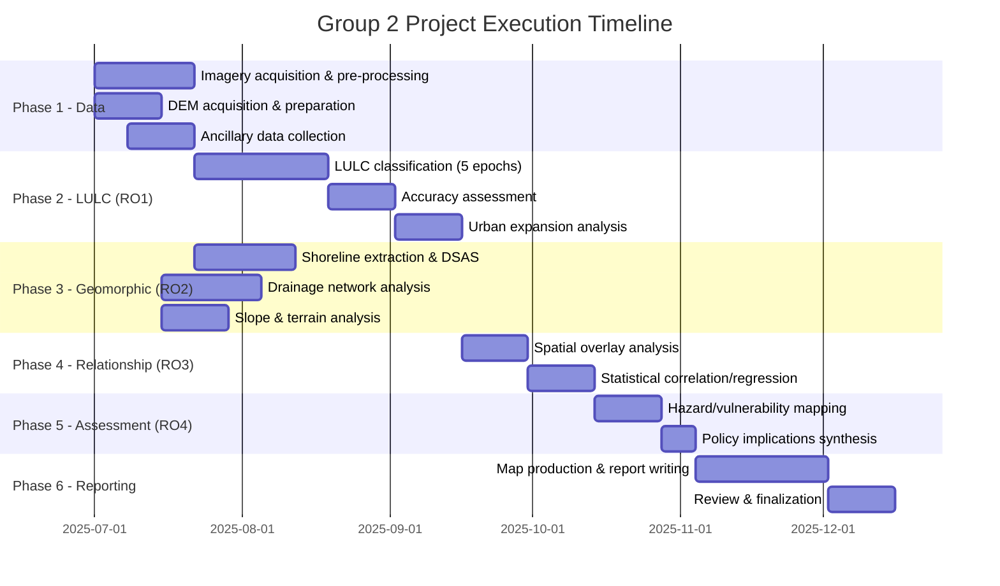

# Group 2 Implementation Guide
## Assessing the Effects of Urban Expansion on Geomorphic Features in Cape Coast Metropolis, Ghana

---

## 1. Project Synopsis

| Attribute | Detail |
|---|---|
| **Study Area** | Cape Coast Metropolis (5°06′N, 1°15′W), Central Region, Ghana |
| **Temporal Scope** | 1990–2025 (35-year multi-temporal analysis) |
| **Core Discipline** | Urban Geomorphology × Remote Sensing × GIS |
| **Main Objective** | Assess effects of urban expansion on geomorphic features using multi-temporal RS and GIS |
| **Philosophy** | Positivist / Quantitative |
| **Population** | ~169,894 (GSS, 2021) |
| **Climate** | Bi-modal rainfall (800–1,200 mm/yr), peaks May–Jun & Sep–Oct |
| **Geology** | Precambrian Birimian Supergroup, ferruginous tropical soils |

---

## 2. Research Objectives → Implementation Mapping

Each research objective maps to specific technical deliverables:

| # | Research Objective | Key Output | Primary Tool/Method |
|---|---|---|---|
| **RO1** | Map spatial extent & rate of urban expansion (1990–2025) | Multi-temporal LULC maps + urban growth rate statistics | Supervised classification (Landsat/Sentinel-2) |
| **RO2** | Map geomorphic features (shoreline, drainage, slope/land cover) | Shoreline position maps, drainage network maps, slope maps | DSAS, DEM hydrology tools, slope analysis |
| **RO3** | Analyze spatiotemporal relationship between urban expansion & geomorphic change | Correlation/overlay analysis outputs | Spatial statistics, overlay analysis, regression |
| **RO4** | Assess implications for land management & coastal hazard vulnerability | Risk/vulnerability maps + policy recommendations | Multi-criteria hazard assessment |

---

## 3. Theoretical Foundations (Implementation Relevance)

### 3.1 Urban Geomorphology Theory (Douglas 1983; Goudie 2006; Chin 2006)

**What it means for implementation:** Urban land conversion must be treated as a *geomorphic agent*. The analysis must quantify:
- Impervious surface expansion → increased runoff
- Vegetation clearance → soil erosion acceleration
- Slope gradient modification → mass movement risk
- Drainage network disruption → flood susceptibility

### 3.2 Human-Environment Systems Theory (Turner et al., 2003)

**What it means for implementation:** The analysis must capture *feedback loops* — geomorphic changes constrain future development. This requires:
- Bi-directional overlay analysis (urban growth → geomorphic change AND geomorphic hazard → development constraint)
- Temporal sequencing to demonstrate cause-effect directionality

### 3.3 Conceptual Framework Chain

```
DRIVERS → URBAN EXPANSION → GEOMORPHIC DISTURBANCE → PROCESS RESPONSES → CONSEQUENCES → PLANNING RESPONSE
```

Each link in this chain requires a distinct analytical module in the GIS pipeline.

---

## 4. Data Requirements Matrix

### 4.1 Satellite Imagery

| Epoch | Recommended Sensor | Resolution | Source | Cost |
|---|---|---|---|---|
| ~1990 | Landsat 5 TM | 30m | USGS EarthExplorer | Free |
| ~2000 | Landsat 7 ETM+ | 30m (15m pan) | USGS EarthExplorer | Free |
| ~2010 | Landsat 5 TM / Landsat 7 | 30m | USGS EarthExplorer | Free |
| ~2020 | Landsat 8 OLI / Sentinel-2 | 30m / 10m | USGS / Copernicus | Free |
| ~2025 | Sentinel-2 MSI / Landsat 9 | 10m / 30m | Copernicus / USGS | Free |

> [!IMPORTANT]
> Select cloud-free scenes during dry season (Dec–Feb) for consistency. Landsat 7 post-2003 has SLC-off striping — use gap-fill composites or prefer Landsat 5 for ~2005 epoch.

### 4.2 Elevation Data (DEMs)

| Dataset | Resolution | Source | Use |
|---|---|---|---|
| SRTM | 30m | USGS | Baseline slope/drainage (2000) |
| ALOS PALSAR DEM | 12.5m | ASF DAAC | Higher-res slope analysis |
| ASTER GDEM v3 | 30m | NASA LP DAAC | Validation |
| Copernicus DEM | 30m | ESA | Most recent global DEM |

> [!TIP]
> For multi-temporal DEM comparison, consider using ICESat-2 altimetry data or drone-derived DEMs for the 2025 epoch to capture recent terrain changes.

### 4.3 Ancillary Data

| Data Type | Source | Purpose |
|---|---|---|
| Administrative boundaries | Ghana Statistical Service / OpenStreetMap | Study area delineation |
| Population data | GSS Census (2000, 2010, 2021) | Urbanization driver analysis |
| Geological maps | Ghana Geological Survey | Lithology overlay |
| Soil maps | CSIR-SRI / SoilGrids | Erodibility assessment |
| Rainfall data | Ghana Met Agency / CHIRPS | Runoff/erosion modeling |
| Historical shoreline data | Survey Dept / Google Earth Pro | Shoreline validation |
| Road network | OSM / Ghana Urban Roads Authority | Infrastructure expansion proxy |

---

## 5. Methodology Pipeline — What Is Possible

### Phase 1: LULC Classification & Urban Expansion Mapping (RO1)

#### 5.1.1 Pre-processing
- Atmospheric correction (DOS1 or FLAASH for Landsat; Sen2Cor for Sentinel-2)
- Geometric co-registration across epochs
- Cloud masking and mosaicking
- Subsetting to Cape Coast Metropolitan boundary

#### 5.1.2 Classification Approach

**Recommended:** Maximum Likelihood Classification (MLC) or Random Forest

| LULC Class | Description |
|---|---|
| Built-up / Urban | Impervious surfaces, buildings, roads |
| Vegetation | Dense forest, shrubs, agricultural land |
| Bare Soil / Exposed Land | Cleared land, construction sites, degraded areas |
| Water Bodies | Rivers, lagoons, ocean |
| Sandy/Coastal | Beach sediments, dunes |

**Accuracy Assessment:** Minimum 50 validation points per class per epoch. Target ≥85% overall accuracy, Kappa ≥0.80.

#### 5.1.3 Urban Expansion Metrics
- **Areal change** (km² per epoch)
- **Annual expansion rate** (%)
- **Expansion direction analysis** (centroid shift, radial analysis)
- **Post-classification change detection** (from-to matrix)
- **Urban sprawl indices** (Shannon's Entropy, compactness ratio)

**Tools:** ArcGIS Pro, QGIS, Google Earth Engine (GEE), ERDAS IMAGINE

---

### Phase 2: Geomorphic Feature Mapping (RO2)

#### 5.2.1 Shoreline Change Analysis

| Component | Method | Tool |
|---|---|---|
| Shoreline extraction | NDWI thresholding / manual digitization from imagery | ArcGIS / QGIS |
| Shoreline change rates | End Point Rate (EPR), Linear Regression Rate (LRR) | **DSAS (Digital Shoreline Analysis System)** |
| Transect spacing | 50m intervals along coastline | DSAS |
| Net Shoreline Movement (NSM) | Total distance of shoreline movement | DSAS |

> [!NOTE]
> DSAS v5.1 integrates with ArcGIS Pro. Requires a baseline and at least 2 shoreline positions. With 5 epochs (1990–2025), LRR is statistically robust.

#### 5.2.2 Drainage Network Morphology

| Analysis | Method | Tool |
|---|---|---|
| Stream network extraction | D8 flow direction → flow accumulation → stream threshold | ArcGIS Hydrology Toolset |
| Drainage density | Total stream length / catchment area per sub-basin | Spatial Analyst |
| Stream order | Strahler ordering | ArcGIS / QGIS |
| Channel sinuosity | Channel length / valley length | Manual + GIS |
| Multi-temporal comparison | Compare drainage networks across DEM epochs | Overlay analysis |
| Flood-prone area delineation | TWI (Topographic Wetness Index) or flood fill analysis | Raster calculator |

#### 5.2.3 Slope & Terrain Analysis

| Analysis | Output | Tool |
|---|---|---|
| Slope map | Degree/percent slope per DEM | Spatial Analyst |
| Aspect map | Slope orientation | Spatial Analyst |
| Curvature | Profile & plan curvature for erosion susceptibility | Spatial Analyst |
| TWI | Topographic Wetness Index for saturation-prone areas | Raster Calculator |
| Hillshade | Terrain visualization | 3D Analyst |
| Slope instability zones | Slopes >15° with low vegetation + urban encroachment | Multi-criteria overlay |

---

### Phase 3: Spatiotemporal Relationship Analysis (RO3)

#### 5.3.1 Spatial Overlay & Correlation

| Analysis | What It Answers | Method |
|---|---|---|
| Urban expansion × shoreline change | Did coastal urbanization accelerate shoreline retreat? | Buffer overlay + regression |
| Urban expansion × drainage density change | Did urbanization alter drainage networks? | Zonal statistics + correlation |
| Urban expansion × slope instability | Are urbanized slopes more degraded? | Cross-tabulation + chi-square |
| Impervious surface × runoff proxy | Does impervious surface increase correlate with drainage change? | Pearson/Spearman correlation |

#### 5.3.2 Statistical Methods

- **Pearson/Spearman correlation** between urban area % and geomorphic change metrics
- **Chi-square test** for categorical relationships (urbanized vs. non-urbanized × stable vs. unstable)
- **Linear regression** to model urban expansion as predictor of geomorphic change rate
- **Change detection matrices** (cross-tabulation of LULC change vs. geomorphic change)
- **Spatial autocorrelation** (Moran's I) to test for clustering of geomorphic change near urban margins

---

### Phase 4: Hazard & Vulnerability Assessment (RO4)

#### 5.4.1 Multi-Criteria Risk Mapping

Combine geomorphic change outputs into a composite hazard/vulnerability map:

| Factor | Weight (Suggested) | Data Source |
|---|---|---|
| Shoreline retreat rate | 25% | DSAS output |
| Slope instability index | 25% | Slope + curvature + land cover |
| Flood susceptibility (TWI) | 25% | DEM-derived TWI |
| Erosion proximity to settlements | 25% | Buffer analysis |

**Method:** Weighted overlay / AHP (Analytical Hierarchy Process)

#### 5.4.2 Policy Implication Mapping
- Overlay hazard zones with current built-up areas
- Identify settlements in high-risk geomorphic zones
- Map areas where future expansion should be restricted
- Link findings to SDG 11, SDG 13, and SDG 1

---

## 6. Software & Tools Required

| Software | Purpose | License |
|---|---|---|
| **ArcGIS Pro** | Primary GIS platform, DSAS, Spatial Analyst | University license |
| **QGIS 3.x** | Open-source alternative, SAGA/GRASS integration | Free |
| **Google Earth Engine** | Cloud-based classification, time-series analysis | Free (research) |
| **ERDAS IMAGINE** | Advanced image classification | University license |
| **Python (with libraries)** | Automation, statistics, plotting | Free |
| **R / GeoDa** | Spatial statistics, Moran's I, regression | Free |
| **DSAS v5.1** | Shoreline change analysis | Free (USGS) |
| **Google Earth Pro** | Historical imagery validation | Free |

**Key Python Libraries:** `rasterio`, `geopandas`, `scikit-learn`, `matplotlib`, `scipy`, `earthengine-api`

---

## 7. Feasibility Assessment

### 7.1 What Is Fully Feasible (High Confidence)

| Component | Reason |
|---|---|
| Multi-temporal LULC classification (1990–2025) | Free Landsat/Sentinel data available for all epochs |
| Urban expansion rate quantification | Standard RS/GIS workflow |
| Shoreline change analysis (DSAS) | Well-established USGS methodology |
| Slope/terrain analysis from DEMs | SRTM/ALOS freely available |
| Drainage network extraction | Standard DEM hydrology tools |
| Spatial overlay and correlation | Core GIS operations |
| Composite hazard mapping | Weighted overlay is standard |

### 7.2 What Is Feasible with Caveats

| Component | Caveat |
|---|---|
| Multi-temporal DEM comparison | Only SRTM (2000) is a true elevation capture; other DEMs may not show temporal change reliably |
| Drainage network *change* detection | 30m DEMs may miss small urban drainage modifications; field validation needed |
| Statistical causation claims | Correlation ≠ causation; language must remain careful |
| 2025 Sentinel-2 classification | Need to ensure cloud-free recent imagery is available |

### 7.3 What Requires Additional Resources

| Component | Requirement |
|---|---|
| High-resolution terrain change | Drone survey or LiDAR for 2025 epoch comparison |
| Field validation of erosion/slope instability | GPS ground-truthing, field photographs |
| Key informant interviews (mentioned in Ethics) | IRB approval, interview guide, participant recruitment |
| Soil erodibility quantification | Lab testing or reliance on existing soil maps |

> [!WARNING]
> The document mentions key informant interviews and community consultations in the Ethics section, but the methodology section only describes quantitative RS/GIS methods. **Clarify whether qualitative data collection is part of the scope** — this affects IRB requirements, timeline, and budget.

---

## 8. Deliverables Checklist

| # | Deliverable | Format | Linked To |
|---|---|---|---|
| 1 | LULC maps (5 epochs: ~1990, 2000, 2010, 2020, 2025) | Map layouts (A3) + GeoTIFF | RO1 |
| 2 | Urban expansion statistics table | Table + charts | RO1 |
| 3 | Urban growth direction analysis map | Map layout | RO1 |
| 4 | Change detection matrix (from-to) | Table + map | RO1 |
| 5 | Accuracy assessment reports (per epoch) | Table (confusion matrix, Kappa) | RO1 |
| 6 | Shoreline position maps (5 epochs) | Map layout | RO2 |
| 7 | DSAS transect output (EPR, LRR, NSM) | Map + statistics table | RO2 |
| 8 | Drainage network maps (multi-temporal) | Map layout | RO2 |
| 9 | Drainage density change statistics | Table + chart | RO2 |
| 10 | Slope & terrain analysis maps | Map layouts (slope, aspect, TWI) | RO2 |
| 11 | Correlation/regression analysis results | Statistical tables + scatter plots | RO3 |
| 12 | Spatial overlay maps (urban × geomorphic) | Map layouts | RO3 |
| 13 | Moran's I spatial autocorrelation results | Map + statistics | RO3 |
| 14 | Composite hazard/vulnerability map | Map layout | RO4 |
| 15 | Policy recommendation matrix | Table | RO4 |
| 16 | Study area map | Map layout | All |

---

## 9. Recommended Execution Roadmap



---

## 10. Critical Implementation Notes

### 10.1 Consistency Across Epochs
- Use the **same classification scheme** (same classes, same training approach) across all 5 epochs
- Normalize spectral indices where cross-sensor comparison is needed (e.g., Landsat 5 → 8 spectral differences)
- Use the **same DEM processing parameters** (flow accumulation threshold, etc.) for drainage comparison

### 10.2 Coordinate System
- Use **Ghana National Grid (GCS)** or **UTM Zone 30N (EPSG:32630)** consistently across all datasets

### 10.3 Scale Considerations
- 30m Landsat resolution is appropriate for metropolitan-scale LULC analysis
- 10m Sentinel-2 (2020–2025 epochs) offers improved urban boundary detection
- DEM resolution (12.5–30m) limits micro-geomorphic feature detection

### 10.4 Key References from Document
- Douglas (1983) — Urban geomorphology foundation
- Goudie (2006), Chin (2006) — Modern urban geomorphology
- Turner et al. (2003) — Coupled human-environment systems
- Cobbinah & Amoako (2012) — Ghana urban growth
- Yeboah (2000) — Ghana urban patterns
- UN (2022) — Global urbanization statistics
- Ghana Statistical Service (2021) — Cape Coast population

### 10.5 SDG Alignment
- **SDG 11** — Sustainable Cities: hazard-informed urban planning
- **SDG 13** — Climate Action: coastal vulnerability reduction
- **SDG 1** — No Poverty: disaster risk reduction for vulnerable communities

---

## 11. Gaps & Recommendations

> [!CAUTION]
> **The document lacks a detailed methodology section.** It outlines the research philosophy and study area but stops before specifying exact analytical procedures, sampling strategy, or software workflows. The implementation details in this guide are *inferred* from the objectives and standard practice — they should be validated with the research supervisor.

| Gap Identified | Recommendation |
|---|---|
| No specific classification algorithm stated | Use Random Forest (robust, handles mixed pixels well) or MLC |
| No accuracy assessment protocol defined | Use stratified random sampling, minimum 250 total points per epoch |
| No DEM analysis methodology specified | Use SRTM for baseline + Copernicus DEM for recent; acknowledge limitations |
| No shoreline extraction method specified | Use NDWI-based automated extraction validated against manual digitization |
| No statistical test plan detailed | Pre-register analysis plan: Pearson r, Moran's I, chi-square, linear regression |
| Qualitative methods implied (Ethics) but not in Methodology | Clarify scope: is this purely quantitative or mixed-methods? |
| No budget/resource plan | Estimate costs for fieldwork, software licenses, drone surveys if needed |
| Study area map is placeholder | Produce study area map early using OSM + administrative boundaries |

---

> [!TIP]
> **Quick-Start Priority:** Begin with (1) downloading all Landsat/Sentinel imagery for the 5 epochs, (2) acquiring SRTM + ALOS DEMs, and (3) creating the study area boundary shapefile. These three tasks unblock all subsequent analysis phases.
